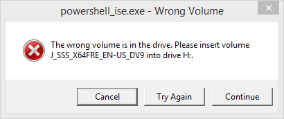
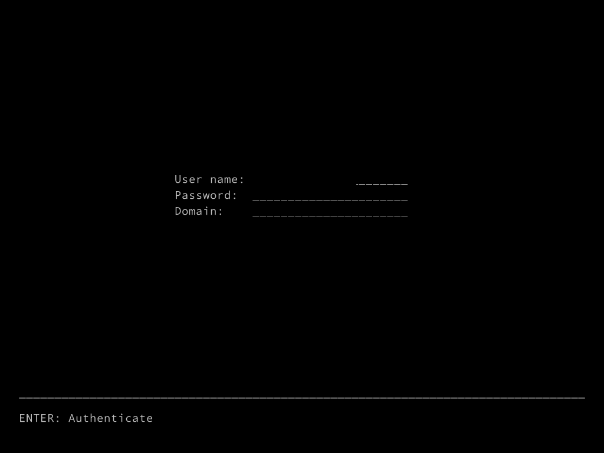

All the recent talk about the new Windows Server Nano (Windows Server Core on diet pills) that is available for installation on the Windows Server 2016 Technical Preview 2 ISO got me quite interested. So, I thought I'd give it a whirl to see what all the fuss was about. Well, first up, it really is as small (568Mb with my chosen packages) and fast as Microsoft says. Second, however, it is most definitely a Tech Preview and is missing lots of stuff and has some obvious issues.

_**Edit - 14 May 2016**: The scripts and process on this page have now been updated to support **Windows Server 2016 Technical Preview 5**. The process will not work for versions earlier than Windows Server 2016 Technical Preview 5. I removed a some parts of this document as they were not correct for TP5. I decided to update this blog post with TP5 information because it is still getting a lot of traffic._

## Manual Install

Installing a copy of Server Nano is not quite as straight forward as mounting the ISO into a VM and booting it up - at least not yet. But if you're still keen to give it a try, Microsoft provides some instructions on how you can install Nano into a VHDx which you can then mount as the boot disk in a Gen-1 or Gen-2 Hyper-V Machine.

The manual instructions to create a VHD with Nano Server on it can be found here:

[Getting Started With Nano Server](https://technet.microsoft.com/en-us/library/mt126167.aspx "Getting Started with Nano Server")

It is well worth reading this to get an idea of how Nano Server is different from regular Core Server.

## Easy Install

As you can see, installing Nano Server requires quite a few steps. None of them are difficult, but I wouldn't be much of a nerd if I didn't convert it into a script. So after a quiet Friday night I managed to cobble something together. You can find it here:

[Create a New Nano Server VHD](https://gallery.technet.microsoft.com/scriptcenter/Create-a-New-Nano-Server-61f674f1 "Create a New Nano Server VHD")

It is fairly straight forward to install and use:

1. Create a **Working Folder** on your computer in the case of this example I used c:\\Nano.
2. Download the _New-NanoServerVHD.ps1_ to the **Working Folder**. Download the Windows Server 2016 Technical Preview ISO ([download here](https://www.microsoft.com/en-us/evalcenter/evaluate-windows-server-technical-preview)) to the **Working Folder**.
3. Open an Administrative PowerShell window.
4. Change directory to the **Working Folder** (cd c:\\nano).
5. Execute the following command (customizing the parameters to your needs):

\[sourcecode language="powershell"\] .\\New-NanoServerVHD.ps1 \` -ServerISO 'c:\\nano\\14300.1000.160324-1723.RS1\_RELEASE\_SVC\_SERVER\_OEMRET\_X64FRE\_EN-US.ISO'' \` -DestVHD c:\\nano\\NanoServer01.vhdx \` -VHDFormat 'VHDx' \` -ComputerName NANOTEST01 \` -AdministratorPassword 'P@ssword!1' \` -Packages 'Storage','OEM-Drivers','Guest' \` -IPAddress '192.168.1.65' \[/sourcecode\]

**Note**: If you run this in the PowerShell ISE, a pop-up message appears during the execution of the above command:

\[caption id="attachment\_179" align="alignnone" width="410"\] This error can be ignored without it causing a problem.\[/caption\]

If this happens, just click **Continue**. I'm not sure why this happens in the ISE, but the script still functions fine if it occurs. I tried to get a screenshot of this but I couldn't get it to happen.

## Booting it up

Once you've the VHD has been created, just create a new or Gen-2 (or Gen-1) Hyper-V Machine and assign this VHDx as the boot disk. Start up the VM and after about a minute (for me anyway) you should be able to use PS remoting (Enter-PSSession) to connect to it and begin playing.

Remember, Server Nano is completely headless (which just sounds cool), so if you try to connect to it using the Hyper-V Console you will see the recovery console:

## Observations

_**Edit - 14 May 2016:** These "issues" have been resolved in more recent versions of Windows Server 2016 Nano Server._

One thing I have noted though, is that if you watch the machine with the Hyper-V Console while it is booting it will show the nice little Windows Start up screen for up to 5 minutes - even though the machine appears to be completely booted and can be connected to. I'm not sure why this is, but I'm sure MS will sort it out.

\[caption id="attachment\_175" align="alignnone" width="660"\] Nano booting up - on my system it can be connected to and used even while the boot screen is showing.\[/caption\]

A second thing I found while writing this script was that in the _Unattend.xml_ file the **ComputerName** is supposed to be set in the _offlineServicing_ phase (according to the MS instructions). But this didn't seem to work for me so my script sets it in both the _offlineServicing_ phase and the _Specialize_ phase. This actually doubles the first boot time from 5 seconds to 10 seconds because it needs to reboot to apply the **ComputerName**.

If anyone reads this and has any ideas on how to improve the process (or if I've gone wrong somewhere), please let me know!
