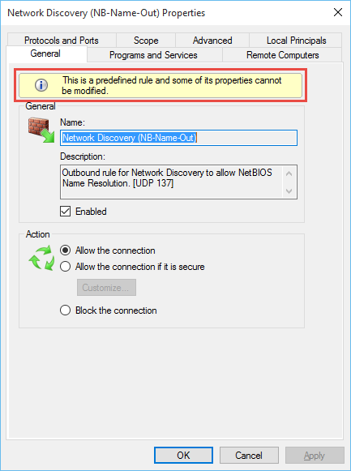

Recently I've been helping resolve a couple of issues with the behavior of the **xFirewall** resource in the [xNetworking](https://github.com/PowerShell/xNetworking) DSC Module. One of these was trying to implement both the Group and DisplayGroup parameters when creating a new Firewall Rule.

\[caption id="attachment\_583" align="alignnone" width="660"\] A Firewall Rule Group/Display Group.\[/caption\]

The obvious assumption is that the **Group** and **DisplayGroup** parameters behave in a similar fashion to the **Name** and **DisplayName** parameters. Unfortunately, this is not the case and it took me quite a lot of digging to figure out how they actually work.

### Why is this Important?

This became an issue for me while trying to determine how to best implement these parameters in the **xFirewall** resource. It became clear that it is not actually possible to set the **DisplayGroup** parameter using any of the **\*-netfirewallrule** cmdlets. So adding this parameter to the resource caused a lot of problems and was also causing quite a bit of confusion, especially as the relationship between **Group** and **DisplayGroup** is not clearly documented anywhere I could find.

You can't even set the **DisplayGroup** parameter via **NETSH** or in the the **WFAS (Windows Firewall with Advanced Security) UI**. In fact the **WFAS UI** only shows the **DisplayGroup** and is labeled as **Group** - the actual **Group** is hidden completely:

\[caption id="attachment\_585" align="alignnone" width="660"\] WFAS UI showing the DisplayGroup (labeled as Group)\[/caption\]

### The Relationship

So, onto the actual reason for this post: What is the relationship between **Group** and **DisplayGroup** and how does **DisplayGroup** get set? I'm hoping this will help someone else who is trying to understand this undocumented behavior.

There are two possible values that the **DisplayGroup** can have and _these can never be set directly_. They are:

1. If **Group** does not start with an **@** then the **DisplayGroup** will be the same as **Group**.
2. If **Group** starts with an **@** then the **DisplayGroup** will be a value pulled from a _DLL_ or _Windows Universal App resource_. This creates the rule as a **predefined** rule.

For example, here is the **DisplayGroup** being pulled from a **DLL**:

And here is a one being pulled from a **Universal App Resource**:

So, what is the take away from all this?

The **DisplayGroup** can't be set manually by you and will never be different to the **Group** unless the **Group** starts with an **@**.

**Note:** A **predefined** rule will prevent most settings of the rule from being changed in the **WFAS UI**, although they still can be changed in PowerShell:

\[caption id="attachment\_588" align="alignnone" width="433"\] A predefined rule can't be changed via the WFAS UI.\[/caption\]

And one final piece of info: The **Group** (and by extension the **DisplayGroup**) can't be changed for an existing rule. You can only change it by deleting and recreating the rule!
