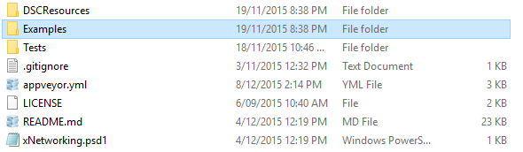
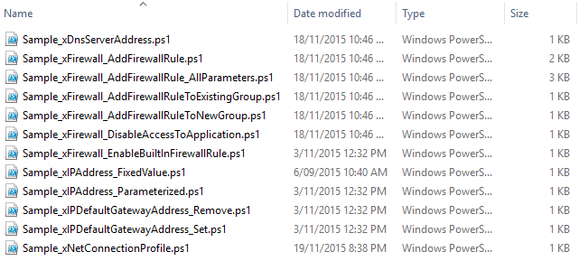

The purpose of this series of articles is to try and document a few of the lessons I learned while releasing new DSC resources as well as contributing to the existing **Microsoft Community DSC resources**. These articles are not intended to tell you how to write DSC resources from a programming perspective, but to give you some ideas on what might be expected of a DSC resource you’re releasing to the public. For example, **unit** and **integration** tests (don’t worry if you aren’t familiar with those terms).

These articles are also not intended to tell you what you **must** do to release your resource, but more document what will help your resource be easier to use and extend by other people. Some of these these things are obvious for people who have come from the **development** community, but may be quite new to **operations** people.

If you missed any previous articles you can find them here:

- [Creating Professional DSC Resources – Part 1](https://dscottraynsford.wordpress.com/2015/12/14/creating-professional-dsc-resources-part-1/)
- [Creating Professional DSC Resources - Part 2](https://dscottraynsford.wordpress.com/2015/12/14/creating-professional-dsc-resoures-part-2/)

 

## Coding Style

Everyone has there own preferences of how they like their code to look. Just take a look at all the PowerShell repositories on **GitHub** and you'd see a lot of different coding styles.

When I refer to _coding style_, this covers a many different things, for example:

- Variable name format
- Tab format (spaces or tabs?)
- Function name format
- Maximum line length
- Comments
- Curly braces allowed at the end of a line
- Allow more than one blank line in a row

If you're writing code that only you will look at and maintain, it doesn't much matter what your _coding style_ is - as long as you can understand it 6 months later. However, if you would like other people to use and possibly  contribute and maintain your code or if you are contributing to community project, you'll want to adopt a _standard coding style_.

The best reason for adopting a _standard coding style_ is to ensure **consistency** in your code - especially across DSC resources within the same module. This makes it much easier for people to become familiar with your coding style and therefore easier for them to read and understand.

If you don't have a particular _coding style_ you have adopted, Microsoft has released a simple [style guidelines document](https://github.com/PowerShell/DscResources/blob/master/StyleGuidelines.md) for **DSC Resources** that you can adopt quite easily.

_**Tip**: Using the Microsoft style guidelines document is a requirement for contributing code to the **Microsoft Community DSC Resources**. So if you're planning on contributing code or even entire resource modules to this project, I'd recommend you adopt the Microsoft style guidelines._

 

## Message Localization

Adding support for language localization to your **DSC Resources** is trivial, but it is often over looked. Supporting data localization is **much** **easier** to add when you are creating your **DSC Resource** rather than adding it later on. This doesn't mean you have to provide the language files of course, just provide support so that someone else could contribute them should they want to.

To ensure language support, create a new file in the same folder as your **DSC Resource** with the same name as the **DSC Resource** but with a **psd1** extension. In that file  create a **Data** section named **LocalizedData** containing the messages for your default **culture**. For example:

\[gist\]dd005b6d3aa1c885b322\[/gist\]

Each line contains a localized message - in this case for the **culture en-us**. You could of course use a different default **culture** if you wanted to.

At the beginning of your **DSC Resource** you would the following command to ensure the appropriate localization strings are imported:

\[gist\]87af9c3719c81e2cf9ef\[/gist\]

Alternately, if you want to support **Message Localization** but don't want to have to supply your default messages in a separate file, you can place the **LocalizedData** section for your default culture at the top of your **DSC Resource** and exclude the **Import-LocalizedData** command.

 

### Using Localization Messages

Once you've got the messages in, using them is extremely easy:

\[gist\]82042370aa15377039fb\[/gist\]

You can of course consume the messages anyway you like, but all of your localized messages are just properties of the **LocalizedData** object.

 

### Other Localization Files

You put **LocalizedData** for other languages in separate PowerShell files in sub-folders named after the culture the file contains. For example, you might create a sub-folder called **en-uk** and place a file called **BMD\_cMyNewResource****.psd1** containing the **en-uk** messages.

 

## Example DSC Configuration Files

Another element of any easy to use **DSC Resource** are example **DSC Configuration** files. These can usually be found in the **Examples** folder in the root of the **DSC Module**:

There should usually be a number of different **DSC Configuration** files in this folder, showing common scenarios for using your **DSC Resources**:

The **file name** of any **example** files should be prefixed with **Sample** or **Example** so that they can be easily identified and differentiated from types of **DSC Module** files. The summary of the purpose of the configuration should also be included in the **file name**. This is fairly obvious I realize, but I have seen public **DSC Resources** named Example\_1, Example\_2, Example\_3 etc - which reduces usability of the examples.

Each **example** should contain a **DSC Configuration** in a form that it could be used without any modification to actually test the resource. This might include installing prerequisite Windows Features or starting services etc. This allows a potential user to **test drive** the resource without investing a whole lot of work trying to figure out how to use it.

For example:

\[gist\]a5aeabe9928fa130ca08\[/gist\]

The above **DSC Resource** example will ensure the **MSiSCSI** service is running before configuring an **iSCSI Initiator**.

_**Tip:** Make the **name** of the **configuration** the same as the sample configuration file (without the extension of course)._

It is also a great idea to copy the content of any **example** **DSC Configuration** files into the **Examples** section of the **Readme.md** of your **DSC Resource Module** along with a brief description of what the configuration will produce. You'll find that all **Microsoft Community DSC Resources** do this.

 

## In The Next Article

I intended on covering creating **unit** and **integration** **tests** in this article, but as that is by far the most involved part of creating a **community DSC resource** I've decided I'll dedicate an entire part to each. So, rest assured the next ones will contain this very important component of any public **DSC Resource**. Thank you for reading this far and I hope you're finding it useful.

Further parts in this series:

- [Creating Professional DSC Resources - Part 4](https://dscottraynsford.wordpress.com/2015/12/18/creating-professional-dsc-resources-part-4/)
- [Creating Professional DSC Resources - Part 5](https://dscottraynsford.wordpress.com/2015/12/20/creating-professional-dsc-resources-part-5/)
- [Creating Professional DSC Resources - Part 6](https://dscottraynsford.wordpress.com/2015/12/23/creating-professional-dsc-resources-part-6/)
