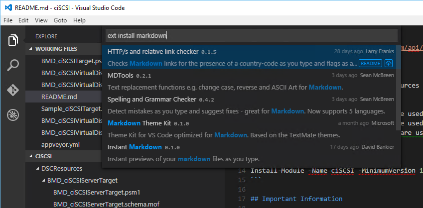
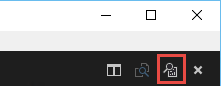
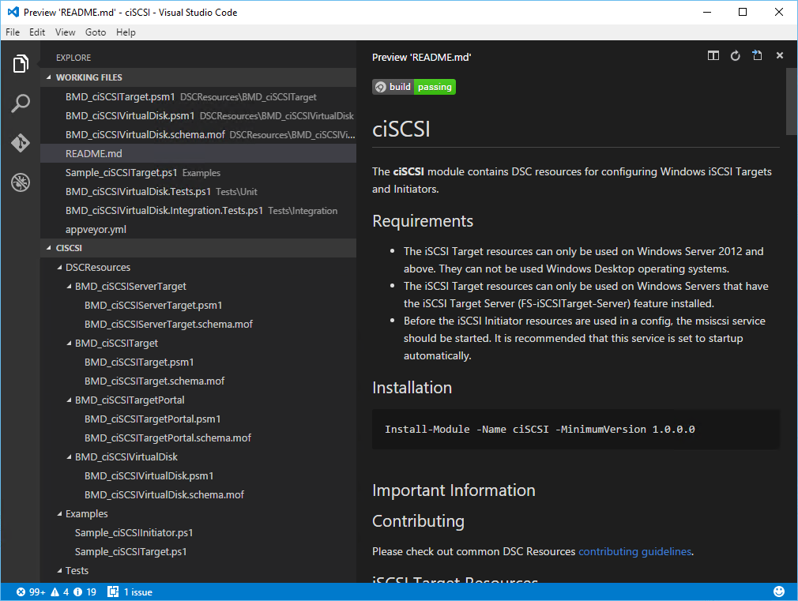
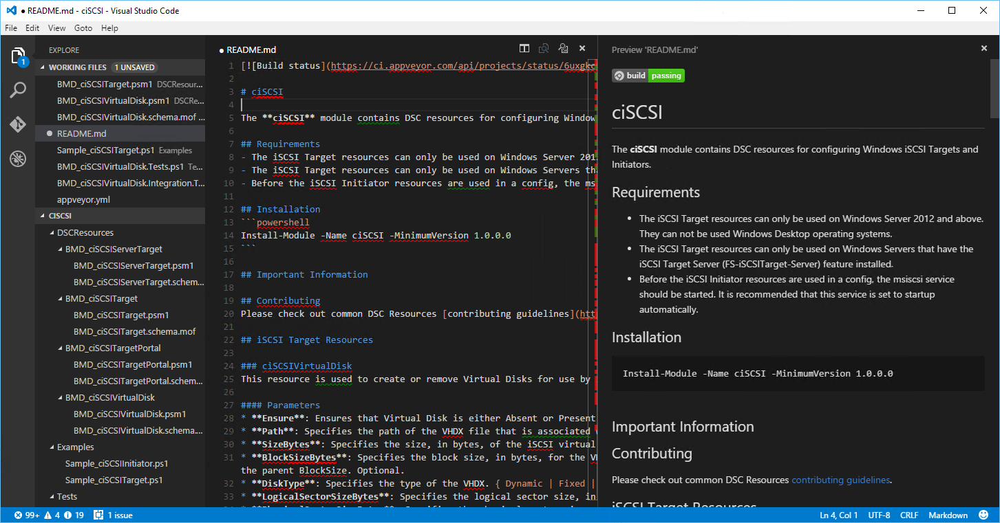

I used to keep around a copy of [Markdown Pad](http://markdownpad.com/) to enable me to preview any [markdown](https://guides.github.com/features/mastering-markdown/) files I created. However, after an update to a **Awesomium** **SDK** Markdown Pad stopped working. I reported the issue but it hasn't been resolved yet.

But after [Irwin Strachan](https://pshirwin.wordpress.com/) mentioned using **Visual Studio Code** as a **Markdown** editor, I wondered if there was an extension that allowed it to **Preview** the **Markdown** as well - because that was really all that was missing for me to do away with **Markdown Pad**. So I went and did a search for **Markdown** extensions in **VS Code**:

\[caption id="attachment\_1585" align="alignnone" width="849"\] Want to install extensions in VS Code? Press F1 and type 'ext install'.\[/caption\]

I found a few, but after playing around with them a bit I noticed a small button in the latest version of **Visual Studio Code** at the top right corner when a **markdown** file is open:

\[caption id="attachment\_1590" align="alignnone" width="221"\] The Preview button!\[/caption\]

I wonder what that might do?

\[caption id="attachment\_1593" align="alignnone" width="1010"\] That is a great looking **markdown** preview.\[/caption\]

Oh, now look at that! Just what I needed. I don't know which version of **Visual Studio Code** this was added in, but it is fantastic!

You can also use the **Visual Studio Code** split window function to **edit** and **Preview** at the same time:

\[caption id="attachment\_1605" align="alignnone" width="1453"\] Changing the markdown automatically updates the preview - nice!\[/caption\]

While we're on the topic of **markdown**, Irwin also pointed me at [this awesome markdown tutorial](http://markdowntutorial.com/) - it makes learning **markdown** fun!

Now, **Visual Studio** **Code** is not on par with [ISE Steroids](http://www.powertheshell.com/isesteroids/) when it comes to editing **PowerShell** files, but when you're dealing with lots of different types of files (including PS files) it can be a real time saver. I highly recommend downloading a copy of [Visual Studio Code](https://code.visualstudio.com/Download), installing the **PowerShell** **Extension** and giving it a try.
