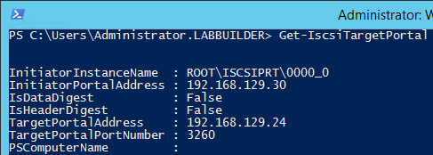
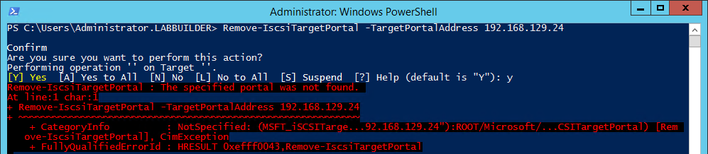
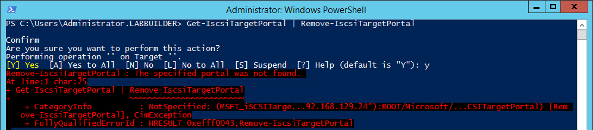
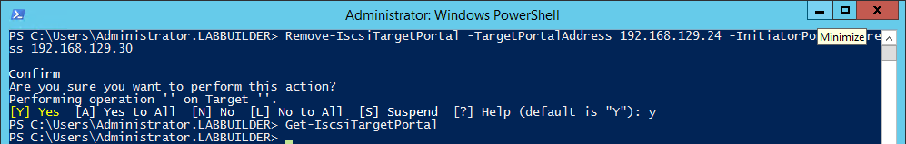

I ran into a small problem with removing **iSCSI Target Portals** using **PowerShell** the other day and thought it might be worth documenting.

Pretend you have an **iSCSI Target Portal** configured with a **Target Portal Address** of 192.168.129.24:

You might therefore expect that you could remove this **Target Portal** with the command:

\[gist\]ccb54927f4ae1d7a7f43\[/gist\]

Unfortunately this won't work:

And neither does this:

What you actually have to do is specify both the **Target Portal Address** and the **Initiator Portal Address** when deleting an **iSCSI** **Target Portal**:

\[gist\]e41f596f6e5a575aa4f2\[/gist\]

Over and out.
