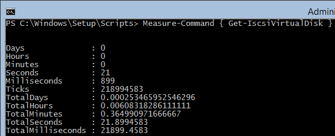

I've been spending a bit of time lately completing a set of **DSC Resources** for configuring **iSCSI** **Targets** and **iSCSI Initiators**. One thing I've noticed is that these **iSCSI** cmdlets are extremely slow:

\[caption id="attachment\_1918" align="alignnone" width="566"\] 21 seconds is just too slow!\[/caption\]

Now, if I was just calling this cmdlet every now and then it really wouldn't matter so much - as long as it works. However, because this cmdlet is going to be called every few minutes when used in a **DSC Resource** it is unacceptable.

I've seen this sort of issue before. It is often caused by the cmdlet looking for things on the network that don't exist. This means that a TCP timeout might occur before the cmdlet will complete. So I thought a way of possibly eliminating this is to specify the computer the cmdlet should work against - in the case of a **DSC Resource** it is always **LocalHost**.

So I gave this a shot:

\[caption id="attachment\_1929" align="alignnone" width="757"\] 49 milliseconds is very acceptable.\[/caption\]

That is a 42,000% speed increase, which is definitely acceptable.

To confirm that the cmdlet is still working as expected:

\[caption id="attachment\_1936" align="alignnone" width="597"\] Yes, all the iSCSI Virtual Disks are there.\[/caption\]

_**Important Note:** You must set the **ComputerName** to the exact test "**LocalHost"** and not the actual computer name of the local machine. If you use the local computer name, the cmdlet will still be slow:_

\[caption id="attachment\_1951" align="alignnone" width="853"\] 21 seconds again, no good.\[/caption\]

All of the **iSCSI Target** cmdlets in the **iSCSI Target** module seem to suffer from this problem, so adding the -**ComputerName LocalHost** parameter to them should speed things up across the board. Obviously, this is only going to work if you're actually manipulating **iSCSI Targets** on the **LocalHost** - if you're trying to configure a remote computer then you'll need to set the remote computer name.

Hope this one shaves a number of seconds off some scripts out there.

Also, Happy 2016!
