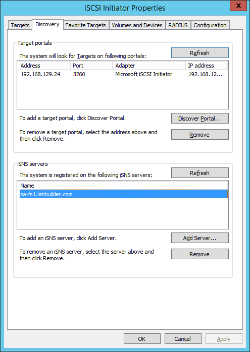
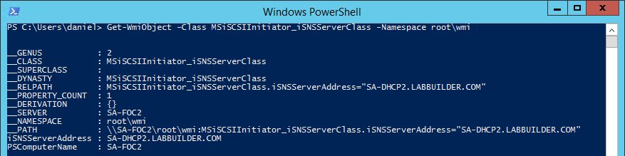

This will just be a very quick post today.

Configuring an **iSCSI Initiator** to use an **iSNS Server** is fairly easy using the iSCSI configuration utility:

But lets face it, that's no fun and it really doesn't fit well when when we have to configure 10's or 100's of initiators or we're using **Server Core**. Not to mention that this is something we'd really want to do with **Desired State Configuration**. Besides, this is a PowerShell blog.

It is [easy enough](https://blogs.technet.microsoft.com/filecab/2012/06/08/iscsi-target-cmdlet-reference/) to configure **iSCSI Targets** to register with an **iSNS Server**:

\[gist\]de9d5068d11d135eb9b1\[/gist\]

But unfortunately I couldn't find any documentation on how to do this on an **iSCSI Initiator**. But after a little bit of digging around WMI I found the appropriate class:

_**MSiSCSIInitiator\_iSNSServerClass**_

So, to add the **iSNS Server** to the **iSCSI Initiator**:

\[gist\]17975238e03fb1db3f87\[/gist\]

Notice that the WMI Class **argument** **name** for the setting the **iSNS Server** name in an **iSCSI Initiator** is different (iSNSServerAddress) compared to setting it for an **iSCSI Target** (ServerName).

To list the currently set iSNS Servers:

\[gist\]76f89aa26791188cac5c\[/gist\]

And if you need to remove an **iSNS Server** from the **iSCSI Initiator**:

\[gist\]b5cac574910ae8d9a1e7\[/gist\]

Pretty easy right?

In a few weeks I plan to integrate iSNS registration with my [iSCSI DSC Resources](https://github.com/PlagueHO/ciSCSI) (also available on [PowerShell Gallery](https://www.powershellgallery.com/packages/ciSCSI/1.0.0.14)) so that the whole process of registering iSCSI Initiators and Targets with iSNS is just a little bit easier.

Thanks for reading.
