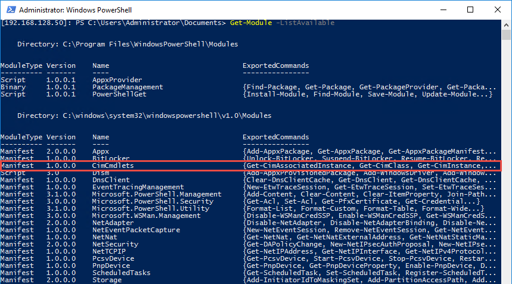

Just a quick Nano server tip for this morning. As of **Windows Server 2016 TP4**, **Nano Server** only contains the **CIM** cmdlets. It does _not_ contain the **WMI** cmdlets:

This is a good thing as it means that we can still perform some tasks that are not covered by the **PowerShell modules** that are provided with Nano Server.
