## **Update 19th February 2018:**

This article has had a lot more attention than I ever expected! This has bought to light several issues with the process as well as changes made to Hyper-V and ESXi that break the process. You could wade through all 256 comments and assemble the corrections yourself, but user @Gambit has helpfully done this for me! So I've included the summary here:

@Tom Watson: Adding a line to /etc/vmware/config with vmx.allowNested = “TRUE” Since all VM’s will be running nested (whole point of article) this is a must if you want them to start! The alternative is adding this line to every VMX file for each guest, Toms solution was much more elegant.

@burnett437: Configure ESXi Management vSwitch “accept” “promiscuous mode”. Apparently this was a known issue even in nested ESXi 5.5. While the host network will operate for a while without problem, the “promiscuous mode” policy will eventually be tripped and you wont be able to talk to the host at random times (I originally thought it was stability issues with the Tulip driver). Now I think this has to due with the nature of nested virtual switches (a VMWare vSwitch insude of a Hyper-V Virtual Switch). When this happens I found you could “down/up” the management vnicX to get it back, but just set the setting not worry about it.

@me: Network threat detection doesn’t like nested virtual switches either. My Symantec Endpoint Client would occasionally block traffic coming from my local NIC (vSphere Client/vSphere Converter) to this nested Host (Windows Firewall did NOT seem to care), but SEP occasionally tripped cause all “suspicious” addressing to the nested host.

@me: Use vSphere converter for guest images coming from other VMWare products….duh. ESXi doesn’t like split vhdk’s, guest won’t boot. This is a beginner mistake, but this article is for Hyper-V admins that may not know the subtle nuances between VMWare products.

@RichMD: I like the idea of hardware pass-through on the NIC. I may tinker with this because it may resolve several issues, not just ESXi v6.5 NIC blacklist issue. Theoretically, passing the physical NIC directly to the nested ESXi Host could/should resolve the “promiscuous mode”, “Network Threat Protection” and even the “Half Duplex Legacy Adapter Requirement” (very slow network performance) problems. I may revisit this…I think my server board has a 2nd NIC I could try this with if I get the time.

## The original article starts here:

Recently I've been playing around with the new Hyper-V Nested Virtualization feature within Windows 10 (build 10565 and greater) and Windows Server 2016. It is pretty cool to be able to create virtualized lab environments running that contain Hyper-V clusters. But what if we want a lab that contains VMWare ESXi Hypervisors running on Hyper-V host. I couldn't find the process documented anywhere and I couldn't even confirm if it should be possible. But after lots of asking a lot of annoying questions - thanks [Adam Burns](https://nz.linkedin.com/in/adam-burns-b8307664) - Googling and hair pulling I managed to get it going:

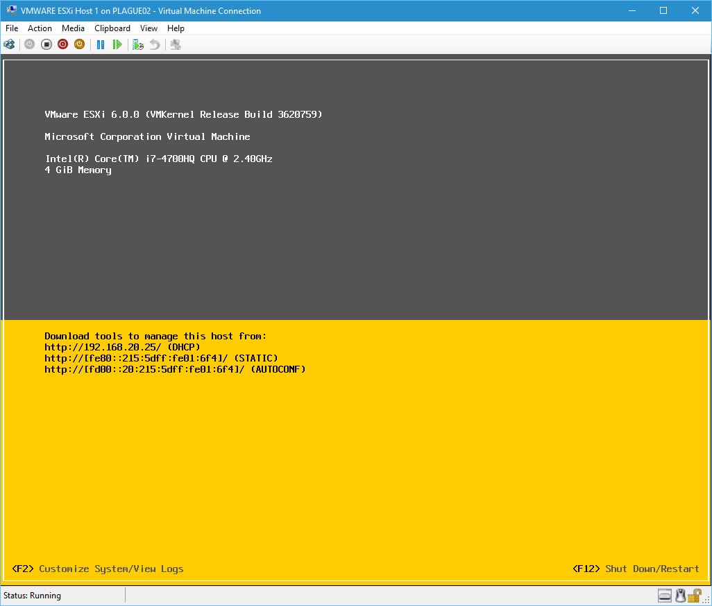

So this seems like a good topic for a blog post.

## What You'll Need

You are going to need a few things to get this working:

- **A Hyper-V** **host** running on Windows 10 (built 10565 or greater) or Windows Server 2016 TP4.
- **Enable-NestedVM.ps1** - A PowerShell script for enabling Nested Virtualization in a Hyper-V VM. Click [here](https://github.com/Microsoft/Virtualization-Documentation/blob/master/hyperv-tools/Nested/Enable-NestedVm.ps1) to get the file from the Microsoft team on GitHub.
- A **VMWare** account - just sign up for one [here](https://my.vmware.com/web/vmware/registration) if you don't already have one.
- **VMWare PowerShell CLI** installed - I used 6.3 release 1 that I downloaded from [here](https://my.vmware.com/group/vmware/get-download?downloadGroup=PCLI630R1).
- **ESXi-Customizer-PS.ps1** - A PowerShell script for injecting network drivers into an ESXi 5.x/6.x ISO. I downloaded it from [here](http://www.v-front.de/p/esxi-customizer-ps.html#download).

I suggest you download all of the above items to a working folder - I called mine **d:\\ESX-In-Hyper-V**, so these instructions will reflect that, but you can call your folder what ever you like.

You should end up with a folder containing these files:


And before you ask: No, you don't need an VMWare ESXi 6.0 ISO - this will get downloaded and produced for us.

## The Process

### Part 1 - Prepare an ESXi 6.0 ISO with Network Drivers

The biggest problem I ran into when trying to install ESXi onto Hyper-V was that the ESXi kernel doesn't come with drivers for the _Microsoft Virtual Network Adapter_ or the _Microsoft Legacy Network Adapter_ (emulates a DECchip 21140). So you'll need to **inject** these drivers into the **VMWare** **ESXi 6.0** ISO. Luckily there is a script available and the appropriate drivers DECchip 21140 (called "net-tulip" for some reason) that makes this process a breeze:

1. Install **WMWare PowerCLI**.
2. Open a **PowerShell** console.
3. Enter the following commands: \[sourcecode language="powershell"\] CD D:\\ESX-In-Hyper-V\\ .\\ESXi-Customizer-PS-v2.4.ps1 -v60 -vft -load net-tulip \[/sourcecode\]
4. After a few minutes the VMWare ESXi 6.0 ISO will be downloaded and the "net-tulip" drivers merged with it:

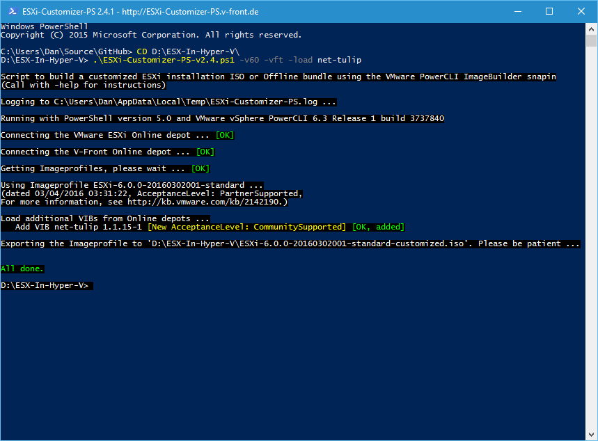

The ISO will now be available in the **D:\\ESX-In-Hyper-V** folder:


### Part 2 - Create the Hyper-V VM

1. In **Hyper-V Manager** create a new Virtual Machine: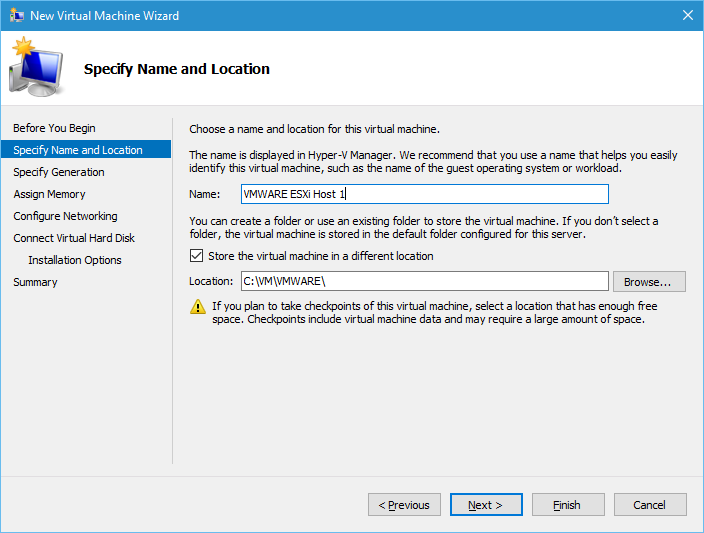
2. Click **Next**.
3. Select **Generation 1** and click **Next**.
4. Set the **Startup Memory** to at least **4096MB**.
5. Uncheck **Use Dynamic Memory for this Virtual Machine:**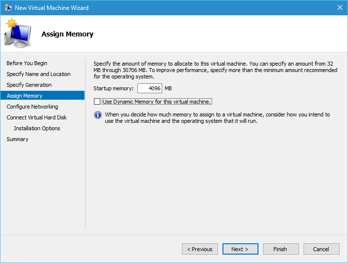
6. Click **Next**.
7. Don't bother to **Configure Networking** on the next step - just click **Next**.
8. Select **Create a new virtual hard disk** and set the **Size** to **10GB** (this is just going to be the boot disk for the ESXi Hypervisor):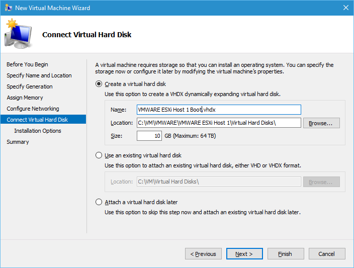
9. Click **Next**.
10. Select **Install an operating system from a bootable CD/DVD-ROM**.
11. Select **Image file (.iso)** and browse to the **ISO** created in **Part 1**.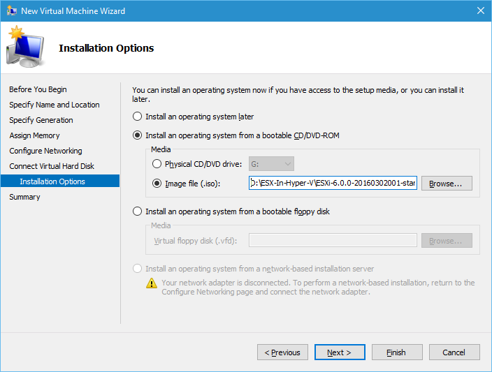
12. Click **Next** then click **Finish** to create the Virtual Machine:
13. Right click the new **Virtual Machine** and select **Settings.**
14. Select the **Processor** node and increase the **Number of Virtual Processors** to **at least 2**: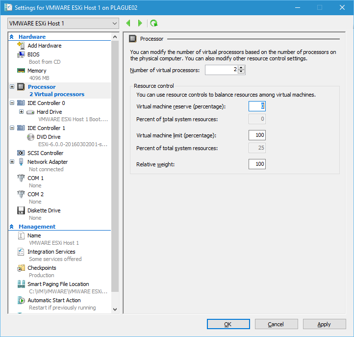
15. Select the existing **Network Adapter** node and click **Remove:**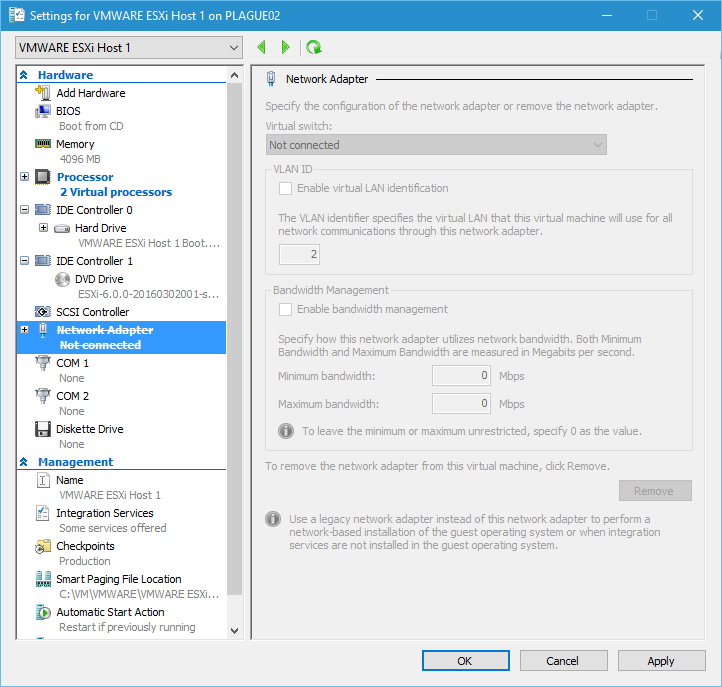
16. Select the **Add Hardware** node and select **Legacy Network Adapter**: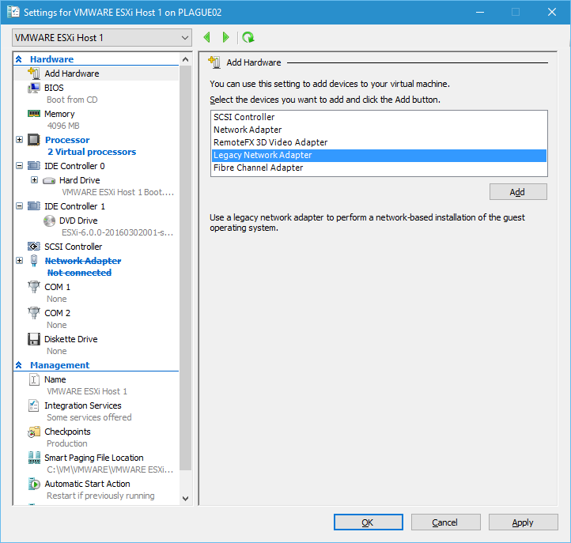
17. Click **Add**.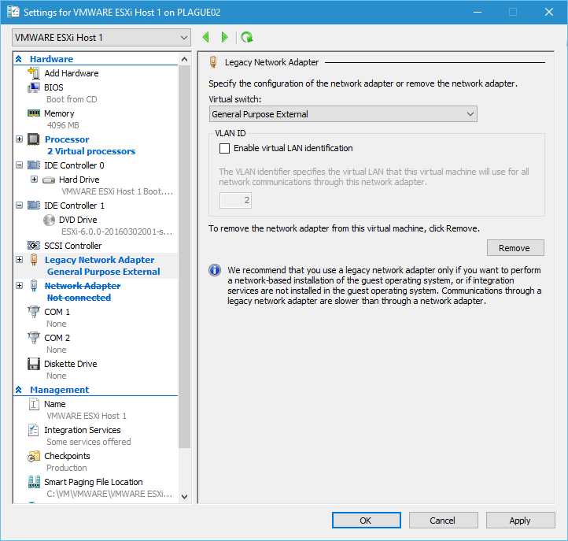
18. Select a **Virtual Switch** to connect the **ESXi Host** to.
19. Click **OK**.

The Virtual Machine is almost ready to start up, but there is one more thing to do.

### Part 3 - Enable Nested Virtualization

Before the starting up the Virtual Machine we need to enable Nested Virtualization Extensions on it. This is done by running a PowerShell script.

1. Open a **PowerShell** console.
2. Enter the following commands (adjusting the **vmName** to match the name of your **Virtual Machine**): \[sourcecode language="powershell"\] CD D:\\ESX-In-Hyper-V\\ .\\Enable-NestedVm.ps1 -vmName 'VMWARE ESXi Host 1' \[/sourcecode\]
3. Enter **Y** when asked to confirm any of the changes:
4. The **Virtual Machine** is now ready to have **ESXi** installed into it.

If you run into any problems with enabling nested virtualization, I'd recommend [reviewing the documentation](https://msdn.microsoft.com/en-us/virtualization/hyperv_on_windows/user_guide/nesting). Covering all the possible ways Nested Virtualization might not be configured correctly is beyond the scope of this post. Also, this is still a **preview feature** and so may still have issues.

### Part 4 - Boot ESXi Virtual Machine

1. Start up the **ESXi Virtual Machine** and make sure you're **connected** to it so you can see the ESXi boot screen: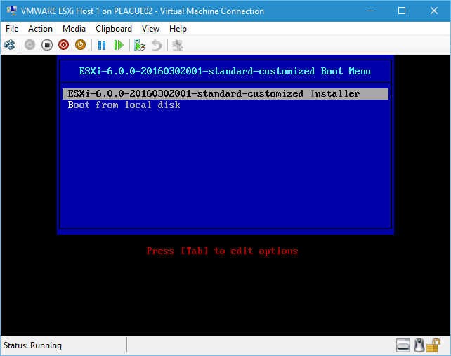
2. Quickly press **Tab.**
3. Add the **ignoreHeadless=TRUE** to the **Boot Options**: 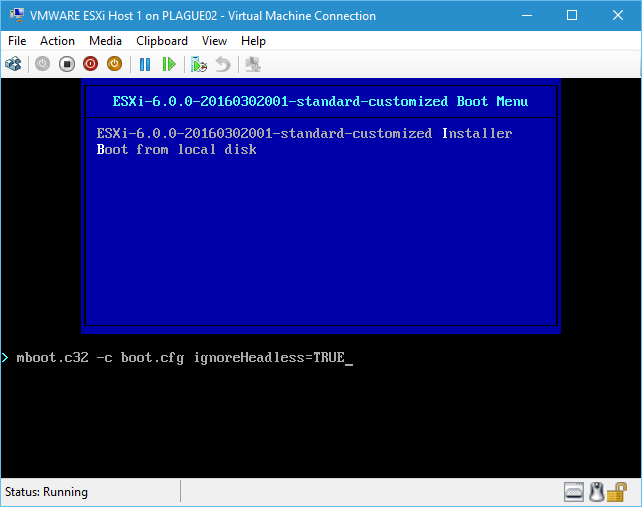
4. Press **Enter**.
5. The **ESXi Installation** system will start up.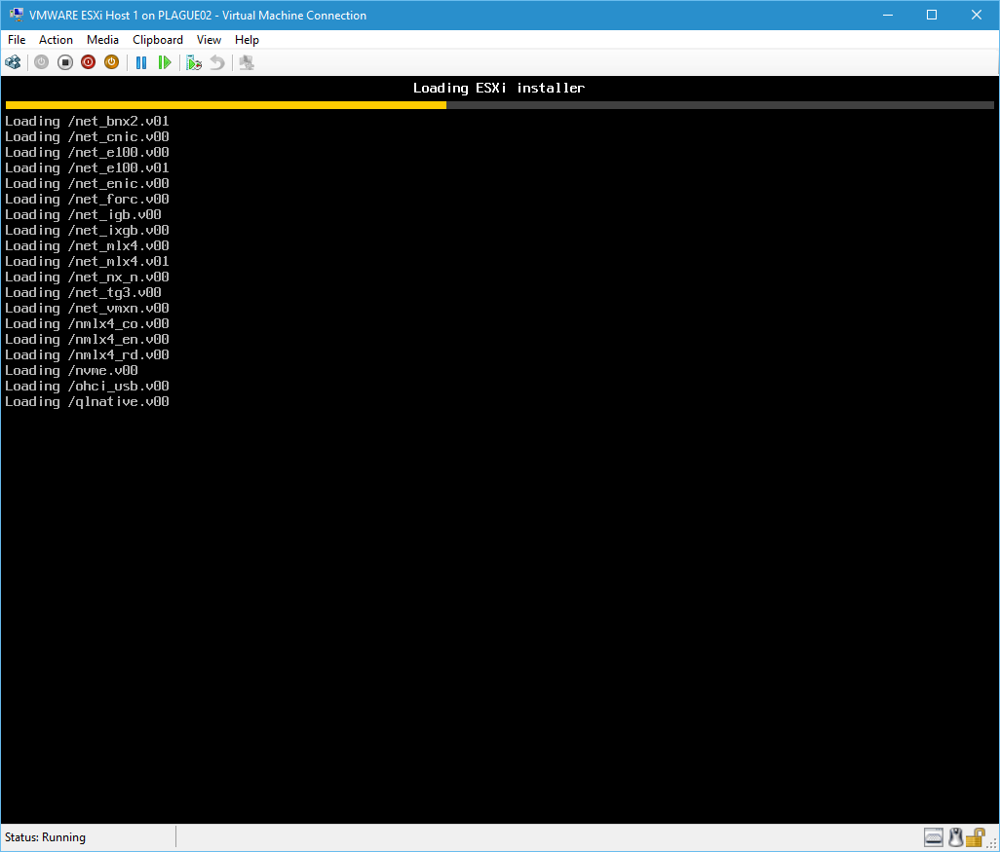
6. After a couple of minutes the **VMWare ESXi 6.0.0 Installer** will start up:
7. You can now go through the **ESXi** installation process.
8. You will receive this warning during the installation process but you can ignore it:
9. The installation process will begin: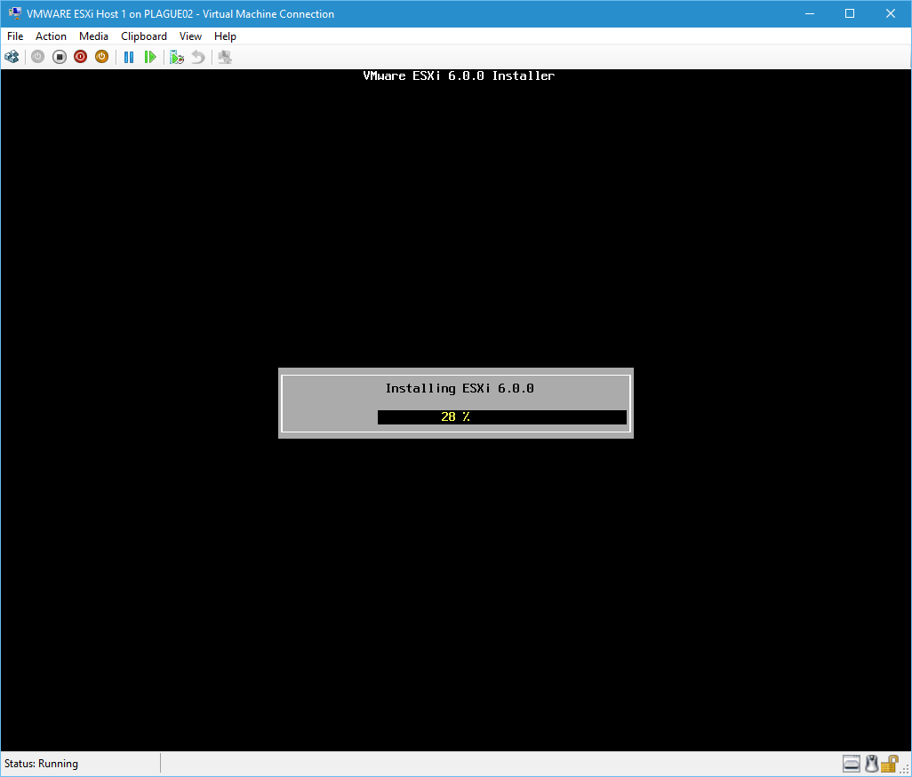
10. Once the **ESXi** installation has completed you will see this message: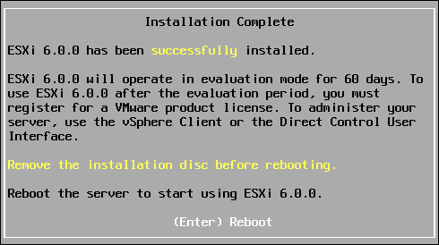
11. Eject the **ESXi Installation ISO** before rebooting the **Virtual Machine:**
12. Press **Enter** to reboot the **VM**.

### Part 5 - Configure the ESXi Boot Options

The final thing we have to do is permanently set the boot options for the **ESXi** host so that the **ignoreHeadless** setting is always set to **TRUE**.

1. When the **ESXi** machine reboots, quickly press **SHIFT-O** to set the **boot options**.
2. Add the **ignoreHeadless=TRUE** to the **Boot Options**:
3. Press **Enter** to boot up the **ESXi** host:
4. Once the **ESXi** has booted up, press **F2**.
5. Enter the **root** login **credentials** that were set during the **ESXi** installation process.
6. Select **Troubleshooting Options** and press **Enter**.
7. Select **Enable ESXi Shell** and press **Enter:**
8. Press **ALT+F1** to bring up the console: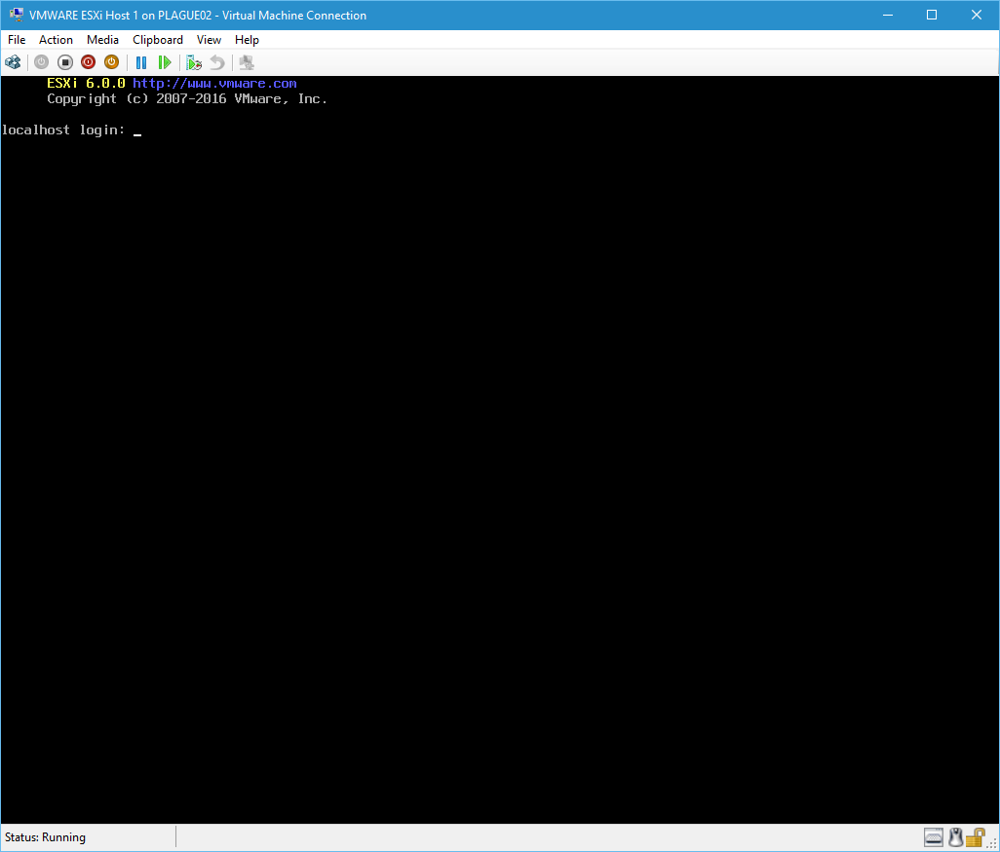
9. Enter your **root** credentials.
10. Enter the following command:
    
    ```
    esxcfg-advcfg --set-kernel "TRUE" ignoreHeadless
    ```
    
    
11. Press **ALT+F2** to return to the main **ESXi** screen.

The **ESXi** host can now be restarted without having to worry about the **ignoreHeadless=TRUE** setting.

You now have a fully running **ESXi Host** running inside a **Hyper-V Virtual Machine**. I shouldn't have to point out that this is a completely unsupported way of installing an **ESXi Host** and should never be used for production workloads. But at least we now have a way of running **ESXi Hosts** in a **Hyper-V Lab** environment.

Here's hoping that someone finds this useful!
