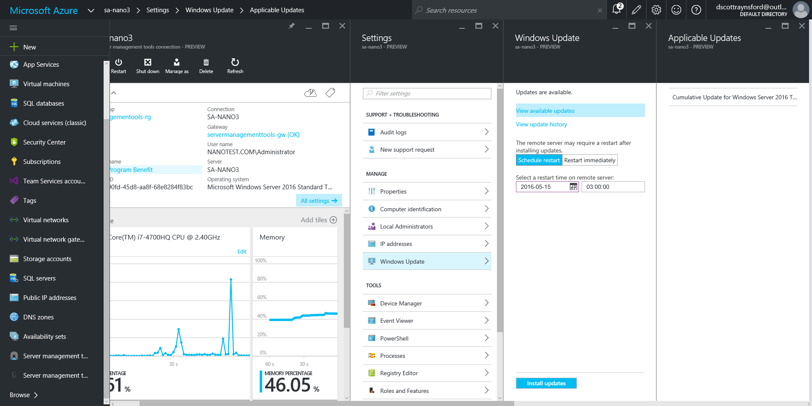
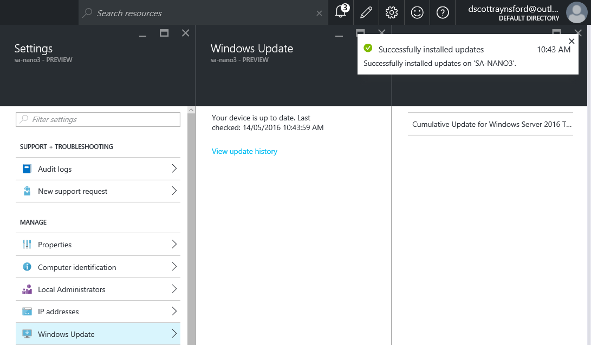

## Introduction

Feel free to skip this introduction and jump down to the [Updating via CIM](#updating-via-cim) section to see the actual update process.

Yesterday, I decided to connect up my Windows Server 2016 TP5 Active Directory lab up to the new [Azure Server Management Tools](https://blogs.technet.microsoft.com/nanoserver/2016/02/09/introducing-server-management-tools/). This was mainly to look at the experience with managing **Nano Server** using these new Azure based tools.

The interface is very slick, as you'd expect from anything managed within the _new Azure Portal_.

I did run into a minor glitch when installing updates, but the team over at **Azure** (major thanks [@BrendanPower](https://twitter.com/brendanpower)) had the problem identified and solved within 24 hours (and was rolled out while I was writing this post). Also remember, this is a **Azure Preview Feature** updating a **Windows Server 2016 Technical Preview 5** operating system, so you'd expect a few glitches. I did a lot of experimenting with these new features and this is the only thing I ran into. I'm still extremely impressed with the responsiveness of the team over there in Redmond.

_In fact while I was writing this very post I was contacted to let me know the fix had gone in to production and it worked perfectly:_

Anyway, this post isn't about how to configure an **Azure Server Management Tools Gateway** (it is extremely easy, but if anyone would be interested in a video let me know and I'll make one), it is about updating **Nano Servers** using **CIM** and by extension **updating lots of servers in one go**.

## Updating via CIM

In Windows Nano Server TP4 Microsoft included CIM cmdlets. This enabled us to use the **root/Microsoft/Windows/WindowsUpdate CIM Namespace** to use Windows Update to install updates on a Nano Server. After a bit of searching around I found [this blog post](https://blogs.technet.microsoft.com/nanoserver/2016/01/16/updating-nano-server-using-windows-update-or-windows-server-update-service/) covering the process.

However, I have lots of Nano Servers and updating them one at a time would be a real pain. So I decided to write a short PowerShell snippet to update all of them at once. This snippet should actually work with any Windows Server 2016 TP4 (or greater) version.

\[gist\]3dd091d45db5800775321fbacfeaf479\[/gist\]

This snippet contains a simple function that takes three parameters:

- **Credential** - this is the credentials to use to connect to the Nano Server and update it. If not passed you will be presented with a login dialog asking for them. It is assumed that all servers being updated use the same credentials.
- **Servers** - this is the array of server names to apply updates to.
- **Install** - setting this optional switch will cause the updates to be installed. If it is not set you will just be told for each server the list of updates that are required.
- **Restart** - this optional switch will cause the servers to automatically restart after updates are installed (even if they don't technically need a restart). Only set this switch if the **Install** switch is set.

For example, calling the function with:

\[sourcecode language="powershell"\] Get-AvailableUpdates \` -Servers 'SA-NANO1','SA-NANO2','SA-NANO3','SA-NANO4','SA-NANO5','SA-NANO6','SA-NANO7','SA-NANO8' \[/sourcecode\]

Would show the update status of the eight listed Nano Servers and show any updates available to be installed:

However, adding an **\-install** parameter to the call:

\[sourcecode language="powershell"\] Get-AvailableUpdates \` -Servers 'SA-NANO1','SA-NANO2','SA-NANO3','SA-NANO4','SA-NANO5','SA-NANO6','SA-NANO7','SA-NANO8' \` -Install \[/sourcecode\]

Will cause all available updates to be installed onto the listed Nano Servers:

You may still need to restart these servers after the updates are installed. If you run the function again without restarting the servers first you will be told the updates still need to be installed. If you want the servers to automatically be restarted, add a -restart parameter:

\[sourcecode language="powershell"\] Get-AvailableUpdates \` -Servers 'SA-NANO1','SA-NANO2','SA-NANO3','SA-NANO4','SA-NANO5','SA-NANO6','SA-NANO7','SA-NANO8' \` -Install \` -Restart \[/sourcecode\]

Like this:

This is even more useful when you consider that you can update standard (Core and GUI) Windows Server 2016 installations like this as well. This might also work on earlier versions of Windows Server (2012, 2012 R2) as well, but I don't have time to try this out.

_Edit: 21 May 2016 - I tested this on Windows Server 2012 R2, but it does not work because the required CIM classes are not available on that version Operating System._

_Note: I really haven't put much work into error checking or reporting on this process, so if you run into any errors (servers not online, bad credentials etc) then they might not be handled elegantly. This code is really an example of what can be easily done._

This function would be a definite candidate for a **PowerShell Workflow** - allowing complete parallelization of the process.

I hope this is useful and have a great weekend!
