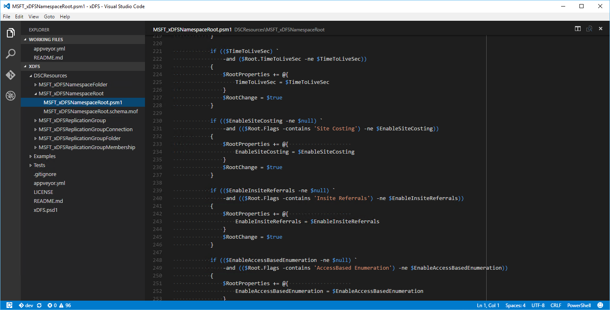
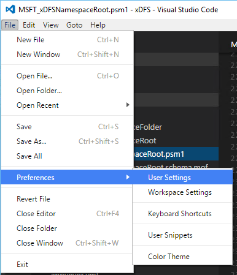
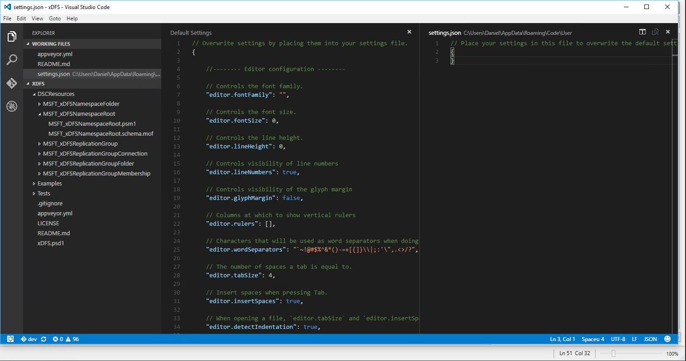
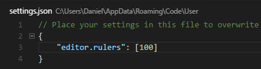
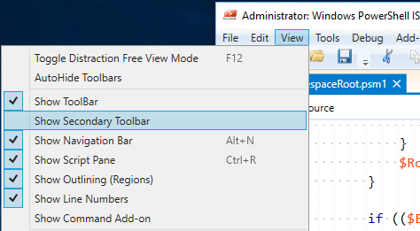
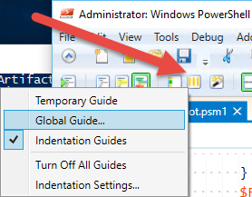
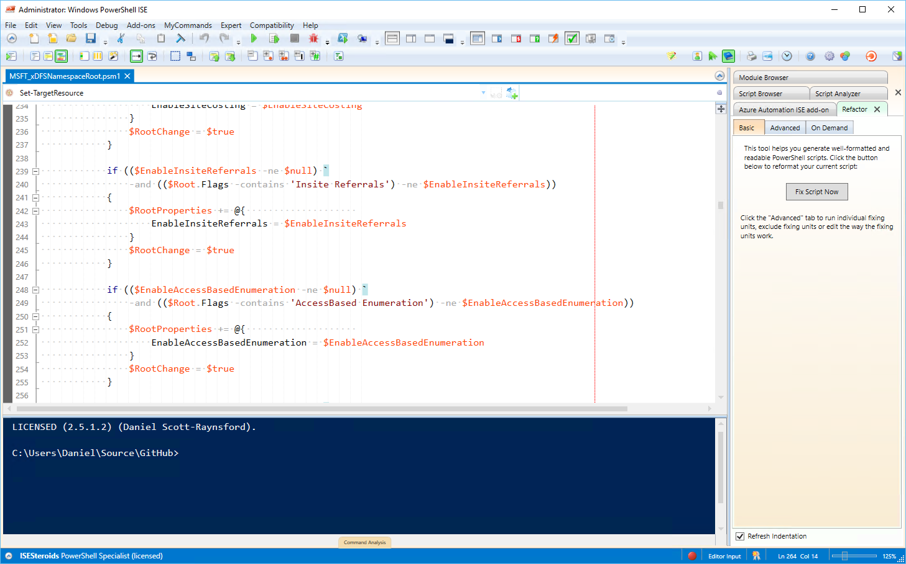

To make it easier for _reviewers_ and _other programmers_ to read PowerShell code it is recommended that lines of PowerShell code don't exceed 100 characters. If you run past this limit you should usually split the line using a **backtick** (\`). I also find that this limit prompts me to rethink my code logic if the line gets too long. Besides, no one wants to have to scroll several pages horizontally to be able to read your whole line of code.

However, one of the most common issues I run into when reviewing (or writing my own) PowerShell DSC resources is going over the 100 character limit. For your own projects you're most welcome to use any styles that you want (although I'd still recommend this one for the reasons above). However, if you're going to commit this code to the PowerShell DSC community resources you'll need to ensure your code [meets this requirement](https://github.com/PowerShell/DscResources/blob/master/StyleGuidelines.md#each-line-should-have-less-than-100-characters), otherwise reviewers will likely ask you change it.

But there is an easy way to help identify this problem if you're using Visual Studio Code or PowerShell ISE Steroids: _Setup a vertical guide/ruler at 100 characters_.

\[caption id="attachment\_3746" align="alignnone" width="1498"\] A nice easy to see vertical ruler/guide tells us when our lines get too long... oh dear this line is too long.\[/caption\]

## To Set up a Vertical Ruler in Visual Studio Code

1. Select **User Settings** (you can use **Workspace Settings** if you want) from **Preferences** in the **File** menu: 
2. Your user **settings.json** file will load on the right, with the **Default Settings** on the left: 
3. Add the following line to your settings.json file in between the braces:
    
    "editor.rulers": \[100\]
    
    
4. Save the file and restart **Visual Studio Code**.

## To Set up a Vertical Ruler in ISE Steroids

1. Select **Show** **Secondary Toolbar** from the **View** menu.
2. Click the **Vertical Guides** button and select **Global Guide...**
3. Enter **100** in the input box and press enter.
    
    \[caption id="attachment\_3791" align="alignnone" width="1457"\] The vertical guide is added - better fix that long line!\[/caption\]

That is all there is to using vertical guides. Having them setup if you're planning on committing code to a community project might save you some extra commits and help the community reviewers merge your code faster.

Happy coding!
