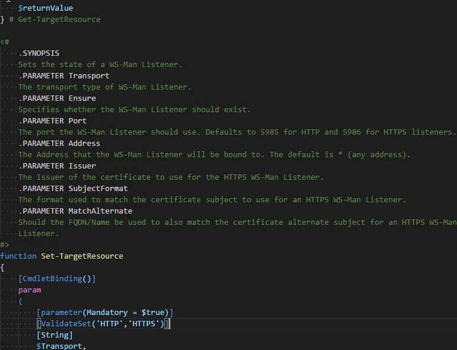
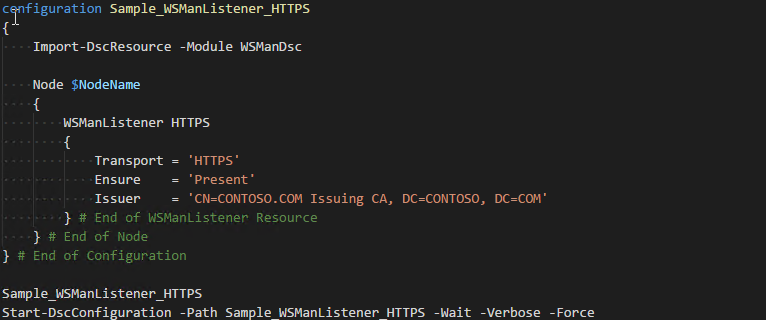
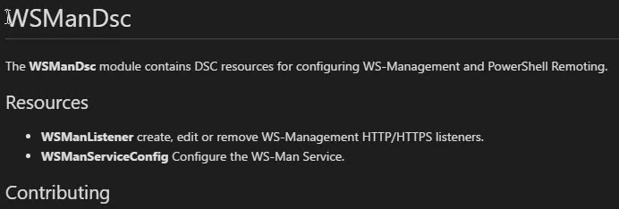
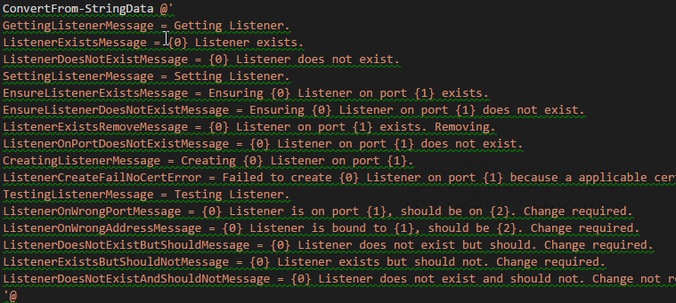
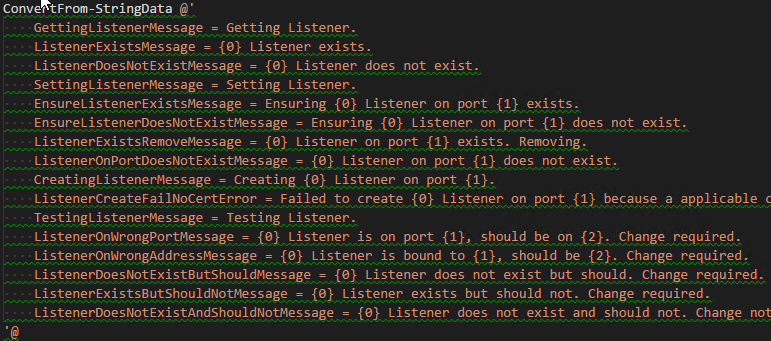

I've spent a fair amount of time recently working on getting some of my DSC Resources ([SystemLocaleDsc](https://github.com/PlagueHO/SystemLocaleDsc), [WSManDsc](https://github.com/PlagueHO/WSManDsc), [iSCSIDsc](https://github.com/PlagueHO/iSCSIDsc) and [FSRMDsc](https://github.com/PlagueHO/FSRMDsc)) accepted into the **[Microsoft DSC Community Resource Kit](https://github.com/PowerShell/DscResources)**. Some are nearly there (SystemLocaleDsc and WSManDsc), whereas others have a way to go yet.

I've had one resource already accepted ([xDFS](https://github.com/PowerShell/xDFS)) into the **DSC Community Resource kit**, but this was before the **High Quality Resource Module** (HQRM) guidelines became available. The [HQRM guidelines](https://github.com/PowerShell/DscResources/blob/master/HighQualityModuleGuidelines.md) are a set of standards that DSC modules **must meet** and **maintain** to be considered a **High Quality Resource Module**. Once they meet these requirements they may be eligible to have the **'x'** moniker removed with '**Dsc**' being added to the name.

_**More information:** If you want to read a bit more about the **HQRM** standards, you can find the HQRM Guidelines [here](https://github.com/PowerShell/DscResources/blob/master/HighQualityModuleGuidelines.md)._

Any modules being submitted for inclusion into the **DSC Community Resource kit** will be expected to meet the **HQRM** standards. The process of acceptance requires three reviewers from the Microsoft DSC team to review the module.

I thought it might be helpful to anyone else who might want to submit a **DSC Resource** into the **DSC Community Resource kit** to get a list of issues the reviewers found with my submissions. This might allow you to fix up your modules before the review process - which will help the reviewers out (they hate having to be critical of your code as much as you do). This enables the submission process to go much faster as well.

_**More information:** If you want to read more about the submission process, you can find the documentation [here](https://github.com/PowerShell/DscResources/blob/master/NewResourceModuleSubmissions.md)._

I'll keep this post updated with any new issues the reviewers pick up. Feel free to ask for clarifications on the issues.

So here is my list of what I have done wrong (so far):

### Missing Get-Help Documentation

Every function (public or private) within the DSC resource module must contain a standard help block containing at least a **.SYNOPSIS** and **.PARAMETER** block:

This will get rejected:

This is good:

### Examples Missing Explanation

All examples in the **Examples** folder and the **Readme.md** must contain an explanation of what the example will do.

This is bad:

This is good:

### Old or Incorrect Unit/Integration Test Headers

There is a standard method of unit and integration testing **DSC Resources**. Your DSC resources should use these methods where ever possible. Any tests should therefore be based on the latest [unit test templates](https://github.com/PowerShell/DscResources/blob/master/Tests.Template/unit_template.ps1) and [integration test templates](https://github.com/PowerShell/DscResources/blob/master/Tests.Template/integration_template.ps1). You should therefore ensure your tests are based on the latest practices and contain the latest header.

_This is probably the hardest thing to get right if you're not paying close attention to the current DSC community best practices around testing. So feel free to ask me for help._

This is bad:

This is good:

### Incorrect Capitalization of Local Variables

Local variables must start with a lower case letter. I needed to correct this on several occasions.

_Note: this is for local variables. Parameter names should start with Uppercase._

This is bad:

This is good:

### Spaces around = in Localization Files

In any localization files you should make sure there is a space on either side of the = sign. This greatly improves message readability.

This is bad:

This is good:

### Missing code of Conduct in Readme.md

All modules that are part of the DSC Resource Kit must contain this message in the Readme.md:

This project has adopted the [Microsoft Open Source Code of Conduct](https://opensource.microsoft.com/codeofconduct/).
For more information see the [Code of Conduct FAQ](https://opensource.microsoft.com/codeofconduct/faq/) or contact opencode@microsoft.com with any additional questions or comments.

This is bad:

This is good:

### Missing Localization file indent

All strings in localization files should be indented.

This is bad:

This is good:

### 

 

### Final Words

There were some other issues raised which I will also document, however I am still in discussion with the DSC team over the best methods to use to solve the issues (specifically the use of **InModuleScope** in unit tests).

The main thing you can do to help speed this process up and reduce the load on the reviewers however is to implement all the [best practices](https://github.com/PowerShell/DscResources/blob/master/BestPractices.md) and [guidelines](https://github.com/PowerShell/DscResources/blob/master/StyleGuidelines.md) listed.

I hope this helps someone out there.
