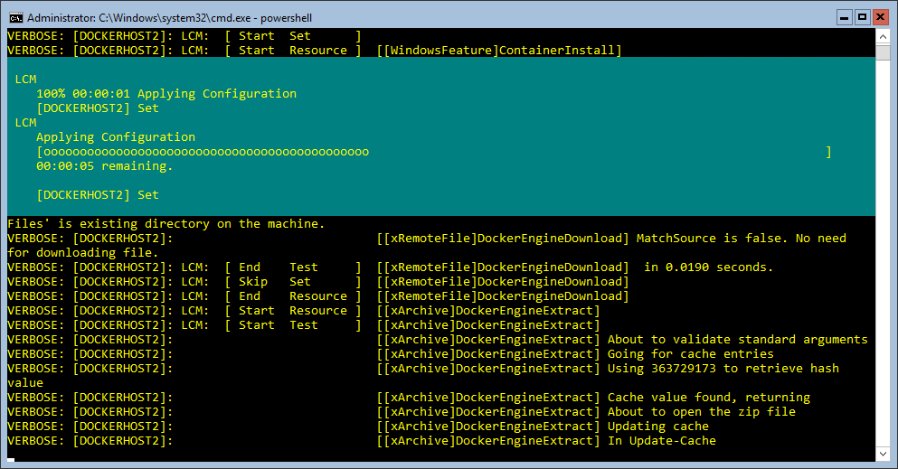
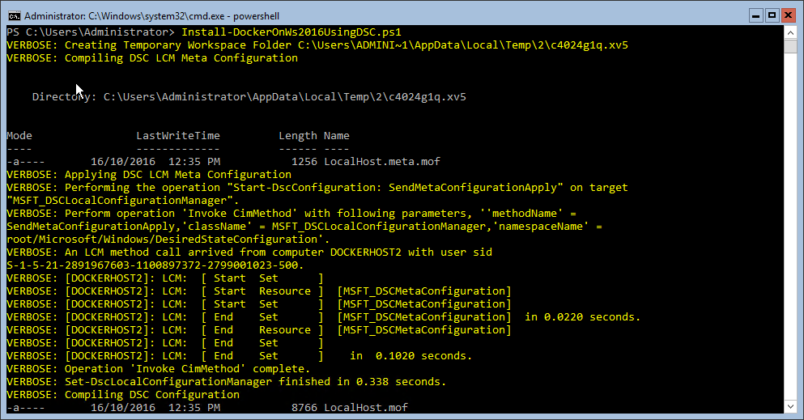
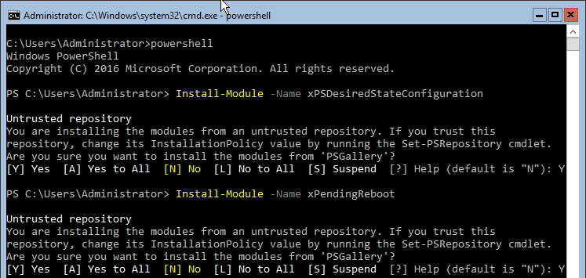
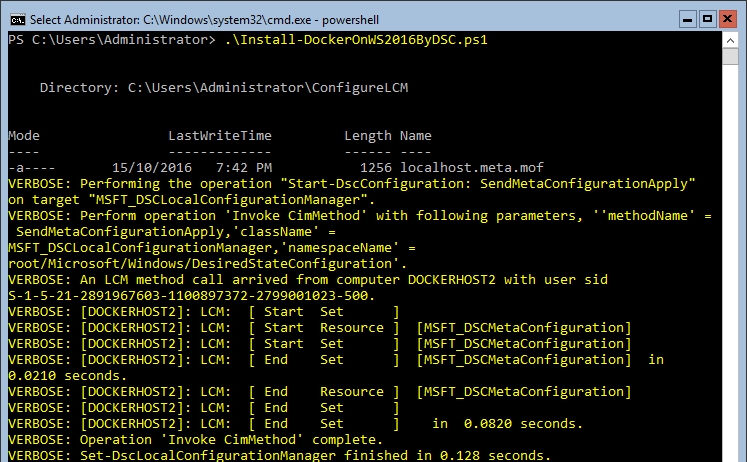

Windows Server 2016 is now GA and it contains some pretty exciting stuff. Chief among them for me is support for containers by way of [Docker](http://www.docker.com/). So, one of the first things I did was start installing Windows Server 2016 VM's (Server Core and Nano Server naturally) and installing Docker on them so I could begin experimenting with Docker Swarms and other cool stuff.

_**Edit: If you're looking for a DSC configuration for setting up Docker on a Windows 10 Anniversary Edition machine, see the Windows 10 AE section below.**_

At first I started using the [standard manual instructions](https://blog.docker.com/2016/09/build-your-first-docker-windows-server-container) provided by Docker, but this doesn't really suit any kind of automation or infrastructure as code methodology. This of course was a good job for [PowerShell Desired State Configuration (DSC)](https://msdn.microsoft.com/en-us/powershell/dsc/overview).

So, what I did was put together a basic DSC config that I could load into a DSC Pull Server and build out lots of Docker nodes quickly and easily. This worked really nicely for me to build out lots of Windows Server 2016 Container hosts in very short order:

If you don't have a DSC Pull server or you just want a simple script that you can use to quickly configure a Windows Server 2016 (Core or Core with GUI only) then read on.

**_Note: This script and process is really just an example of how you can configure Docker Container hosts with DSC. In a real production environment you would probably want to use a DSC Pull Server._**

# Get it Done

_**Edit: After a suggestion from Michael Friis ([@friism](https://twitter.com/friism)) I have uploaded the script to the [PowerShell Gallery](https://www.powershellgallery.com/packages/Install-DockerOnWS2016UsingDSC) and provided a simplified method of installation. The steps could be simplified even further into a single line, but I've kept them separate to show the process.**_

### Using PowerShell Gallery

On a **Windows Server 2016 Server Core** or **Windows Server 2016 Server Core with GUI** server:

1. Log on as a user with **Local Administrator** privileges.
2. Start an **Administrator PowerShell** console - if you're using Server Core just enter **PowerShell** at the command prompt:
3. Install the **Install-DockerOnWS2016UsingDSC.ps1** script from the PowerShell Gallery using this command: \[gist\]a0ccbc56725089e48aa5822ad0189b07\[/gist\] _You may be asked to confirm installation of these modules, answer yes to any confirmations._ 
4. Run the **Install-DockerOnWS2016UsingDSC.ps1** script using: \[gist\]b41364b4ce52ee9c08186ccfa24ae5e6\[/gist\] 

The script will run and reboot the server once. Not long after the reboot the Docker service will start up and you can get working with containers:

You're now ready to start working with Containers.

### The Older Method (without PowerShell Gallery)

On a **Windows Server 2016 Server Core** or **Windows Server 2016 Server Core with GUI** server:

1. Log on as a user with **Local Administrator** privileges.
2. Start an **Administrator PowerShell** console - if you're using Server Core just enter **PowerShell** at the command prompt:
3. **Install the DSC Resources** required for the DSC configuration by executing these commands: \[gist\]71a8cf84d6d13e96a91a2c3ba5209a24\[/gist\] _You may be asked to confirm installation of these modules, answer yes to any confirmations._ 
4. **Download the Docker installation DSC script** by executing this command: \[gist\]00f302a9299702cebbbd2b40de264f55\[/gist\] 
5. **Run the Docker installation DSC script** by executing this command: \[gist\]ef200c931094aa19e752c0429df417bc\[/gist\] 

The script will run and reboot the server once. Not long after the reboot the Docker service will start up and you can get working with containers:

You're now ready to start working with Containers.

# What the Script Does

In case you're interested in what the script actually contains, here are the components:

1. **Configuration ContainerHostDsc -** the [DSC configuration](https://msdn.microsoft.com/en-us/powershell/dsc/configurations) that configures the node as a Docker Container host.
2. **Configuration ConfigureLCM** \- the [LCM meta configuration](https://msdn.microsoft.com/en-us/powershell/dsc/metaconfig) that sets **Push Mode**, allows the LCM to reboot the node if required and configures **ApplyAndAutoCorrect** mode.
3. **ConfigData** - a [ConfigData object](https://msdn.microsoft.com/en-us/powershell/dsc/configdata) that contains the list of node names to apply this DSC Configuration to - in this case LocalHost.
4. **ConfigureLCM** - the call to the **Configuration ConfigureLCM** to [compile the LCM meta configuration MOF file](https://msdn.microsoft.com/en-us/powershell/dsc/metaconfig).
5. **Set-DscLocalConfigurationManager** - this applies the compiled LCM meta configuration MOF file to LocalHost to configure the LCM.
6. **ContainerHostDsc** - the call to the **Configuration ContainerHostDsc** to compile the DSC MOF file.
7. **Start-DSCConfiguration** - this command starts the LCM applying the DSC MOF file produces by the **ContainerHostDsc**.

The complete script can be found [here](https://gist.github.com/PlagueHO/d9595cae1788f436b97bd4c90d50d72e). Feel free to use this code in anyway that makes sense to you.

# What About Windows 10 AE?

If you're looking for a DSC configuration that does the same thing for _Windows 10 Anniversary edition_, **Ben Gelens** ([@bgelens](https://twitter.com/bgelens)) has written an awesome DSC config that will do the trick. Check it out [here](https://gist.github.com/bgelens/152fdc075b6ffcf639da775958076c6a).

 

Happy containering!
