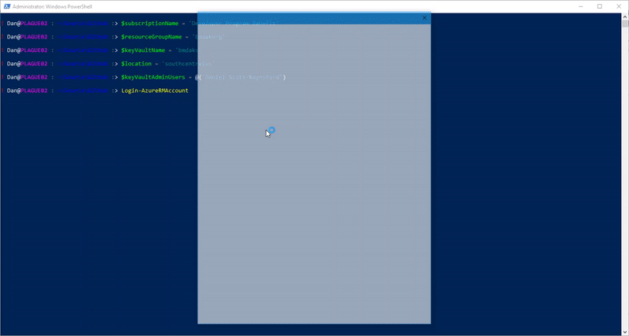
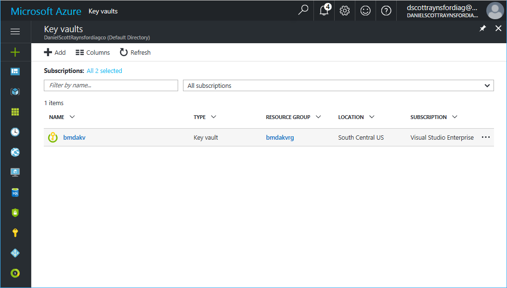
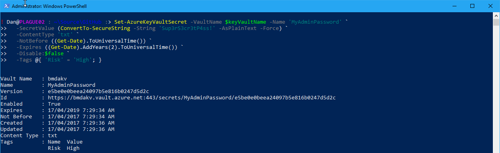
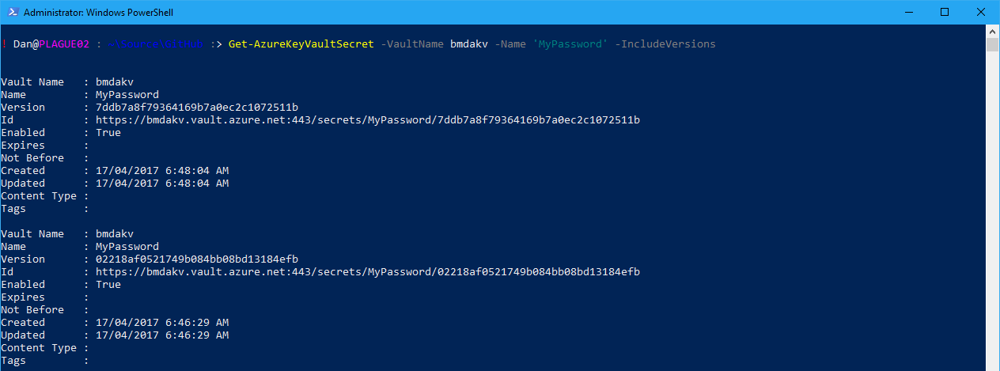

[Azure Key Vault](https://docs.microsoft.com/en-us/azure/key-vault/) is used to safeguard and manage **cryptographic keys**, **certificates** and **secrets** used by cloud applications and services (you can still consume these on-premise though). This allows other application, services or users in an Azure subscription to store and retrieve these **cryptographic keys**, **certificates** and **secrets**.

Once **cryptographic keys**, **certificates** and **secrets** have been stored in a **Azure Key Vault** access policies can be configured to provide access to them by other users or applications.

**Azure Key Vault** also stores all past versions of a **cryptographic key**, **certificate** or **secret** when they are updated. So this allows easily rolling back if anything breaks.

This post is going to show how:

1. Set up an Azure Key Vault using the [PowerShell Azure Module](https://docs.microsoft.com/en-us/powershell/azure/overview).
2. Set **administration access policies** on the **Azure Key Vault**.
3. Grant other _users_ or _applications_ **access** to **cryptographic keys**, **certificates** or **secrets**.
4. **Add**, **retrieve** and **remove** a **cryptographic key** from the **Azure Key Vault**.
5. **Add**, **retrieve** and **remove** a **secret** from the **Azure Key Vault**.

# Requirements

Before getting started there is a few things that will be needed:

1. An **Azure account**. I'm sure you've already got one, but if not [create a free one here](https://azure.microsoft.com/en-us/free/).
2. The **Azure PowerShell module** needs to be installed. [Click here](https://docs.microsoft.com/en-us/powershell/azure/install-azurerm-ps) for instructions on how install it.

# Install the Key Vault

The first task is to customize and install the Azure Key Vault using the following **PowerShell script**.

\[gist\]24bcab61df4741a0c388d3d0467d192a\[/gist\]

But first, the variables in the **PowerShell script** need to be customized to suit. The variables in the **PowerShell script** that needs to be set are:

- **$subscriptionName** - the name of the Azure subscription to install the Key Vault into.
- **$resourceGroupName -** the name of the Resource Group to create to contain the Key Vault.
- **$keyVaultName** - the name of the Key Vault to create.
- **$location** - the Azure data center to install the Key Vault to (use **Get-AzureRMLocation** to get a list of available Azure data centers).
- **$keyVaultAdminUsers** - an array of users that will be given administrator (full control over **cryptographic keys**, **certificates** and **secrets**). The user names specified must match the full name of users found in the **Azure AD** assigned to the Azure tenancy.

It will take about 30 seconds for the Azure Key Vault to be installed. It will then show up in the Azure Subscription:

# Assigning Permissions

Once the **Azure Key Vault** is setup and an administrator or two have been assigned, other access policies will usually need to be assigned to **users** and/or [application or service principal](https://docs.microsoft.com/en-us/azure/active-directory/develop/active-directory-application-objects).

To create an **access policy** to allow a **user** to _get_ and _list_ **cryptographic key****s**, **certificates** and **secrets** if you know the **User Principal Name**:

\[gist\]c430d4f9eafbe4c6d753613365c6b6aa\[/gist\]

_Note: the above code assumes you still have the variables set from the 'Install the Key Vault' section._

If you only have the **full name** of the **user** then you'll need to look up the **Object Id** for the user in the **Azure AD**:

\[gist\]5900d92a9b97e947bc60ff7fe721fefe\[/gist\]

_Note: the above code assumes you still have the variables set from the 'Install the Key Vault' section._

To create an **access policy** to allow a **service principal** or **application** to _get_ and _list_ **cryptographic key****s** if you know the **Application Id** (a GUID):

\[gist\]e079674f79ed6cf87b877d6829735917\[/gist\]

_Note: the above code assumes you still have the variables set from the 'Install the Key Vault' section._

Changing the values of the **PermissionsToKeys****,** **PermissionsToCertificates** and **PermissionsToSecrets** parameters in the cmdlets above allow different permissions to be set for each policy.

The available permissions for **certificates**, **keys** and **secrets** are:

\[gallery ids="5624,5625" type="rectangular"\]

An **access policy** can be removed from **users** or **service principals** using the **Remove-AzureRmKeyVaultAccessPolicy** cmdet:

\[gist\]058455310cdff17b8bdba6ba6db74f6c\[/gist\]

_Note: the above code assumes you still have the variables set from the 'Install the Key Vault' section._

# Working with Secrets

**Secrets** can be _created_, _updated, retrieved_ and _deleted_ by users or applications that have been assigned with the **appropriate policy**.

## Creating/Updating Secrets

To create a new secret, use the **Set-AzureKeyVaultSecret** cmdlet:

\[gist\]45d281e3f6dc58107fbb6f982c27b4e8\[/gist\]

_Note: the above code assumes you still have the variables set from the 'Install the Key Vault' section._

This will create a secret called **MyAdminPassword** with the value **P@ssword!1** in the **Azure Key Vault**.

The secret can be updated to a new value using the same cmdlet:

\[gist\]fe8da3ca6a0ac7e543e2f9c1de1339f9\[/gist\]

**Additional parameters** can also be assigned to each version of a secret to control how it can be used:

- **ContentType** - the type of content the secret contains (e.g. 'txt')
- **NotBefore** - the date that the secret is valid after.
- **Expires** - the date the secret is valid until.
- **Disable** - marks the secret as disabled.
- **Tag** - assigns tags to the secret.

For example:

\[gist\]20e433002d73a69e2b7ef9318d9b4b9b\[/gist\]

## Retrieving Secrets

To retrieve the **latest (current) version** of a secret, use the **Get-AzureKeyVaultSecret** cmdlet:

\[gist\]335c7a9420ccdf1c2c0c7559b5d01db9\[/gist\]

This will assign the stored secret to the variable **$secretText** as a **SecureString**. This can then be passed to any other cmdlets that require a **SecureString**.

To list **all** the versions of a secret, add the **IncludeVersions** parameter:

\[gist\]82cc3c622a43673c5b35e9eb5ed0710b\[/gist\]

To retrieve a **specific version** of a secret, use the **Get-AzureKeyVaultSecret** cmdlet with the **Version** parameter specified:

\[gist\]12b88cde2f6c67cefd2c1a17710b4936\[/gist\]

## Removing Secrets

Finally, to remove a secret use the **Remove-AzureKeyVaultSecret** cmdlet:

\[gist\]5892377f9952506199c1d3843a028cd8\[/gist\]

That pretty much covers managing and using **secrets** in **Azure Key Vault** using **PowerShell****.**

# C**ryptographic keys** and C**ertificates**

In the next part of this series I'll cover using **Azure Key Vault** to use and manage **cryptographic keys** and **certificates**. Thanks for sticking with me this far.
