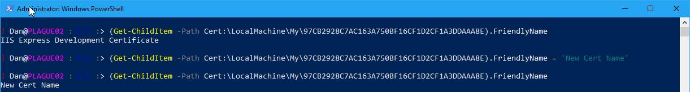
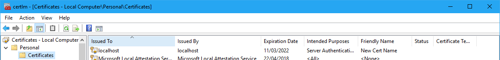

While working on adding a new feature in the certificate request DSC resource, I came across this handy little trick: You can change the Friendly Name of a certificate using PowerShell.

All you need to do is identify the certificate using Get-ChildItem and then assign the new FriendlyName to it.

\[gist\]ab6ed6e6e9f38a286608ffda6b9aca0c\[/gist\]

Sometimes PowerShell still surprises me at how easy it can make things. I didn't need to search help or the internet - just typed it in and it worked!
