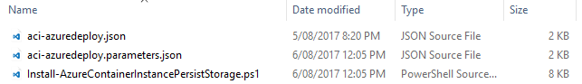
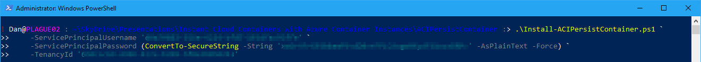
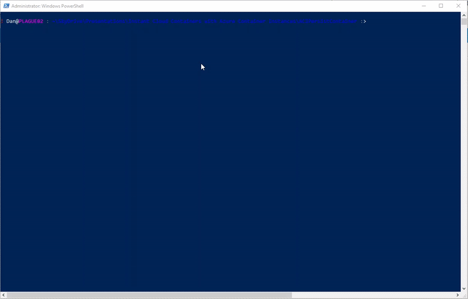
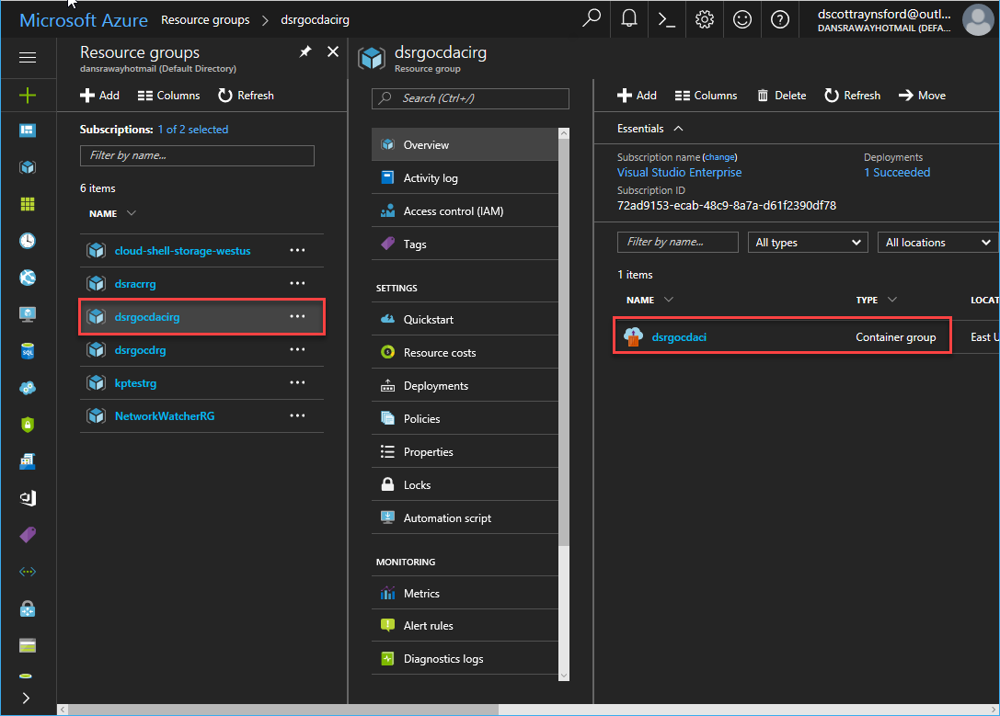
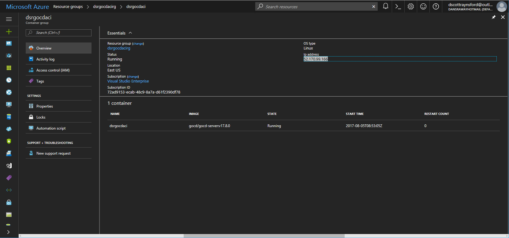
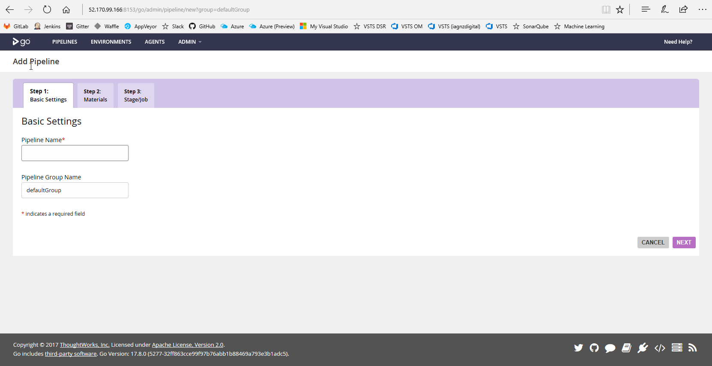
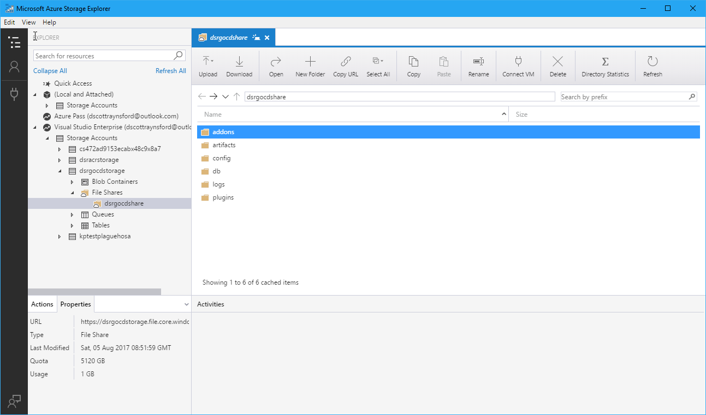

_**Update 2018-04-26:** At some point Microsoft made a change to the requirements of the ARM template creating the Azure Container Instance. It now requires the Ports to be specified within the container as well as we the container group. I have **improved the ARM template** to meet the current requirements._

_**Update 2017-08-06:** I have **improved the script** so that it is idempotent (can be run more than once and will only create anything that is missing). The Azure Container Instance resource group can be deleted once you've finished with the container and then recreated again with this same script when you next need it. The storage will be preserved in the separate storage account resource group. The script can now be run with the **\-verbose** parameter and will produce much better progress information._

[Azure Container Instances](https://azure.microsoft.com/en-us/services/container-instances/) **(ACI)** is a new resource type in **Azure** that allows you to quickly and easily create containers without the complexity or overhead of [Azure Service Fabric](https://azure.microsoft.com/en-us/services/service-fabric/), [Azure Container Services](https://azure.microsoft.com/en-us/services/container-service/) or provisioning a Windows Server 2016 VM.

It allows you to _quickly_ create containers that are _billed by the second_ from container images stored in **Docker Hub** or your own [Azure Container Registry](https://azure.microsoft.com/en-us/services/container-registry/) **(ACR)**. Even though this feature is still in preview, it is [very easy to get up and running](https://docs.microsoft.com/en-us/azure/container-instances/) with it.

But this post _isn't_ about creating basic container instances, it is about running container instances where some of the **storage must persist**. This is a basic function of a container host, but if you don't have access to the host storage then things get more difficult. That said, **Azure Container Instances** do support _mounting Azure File Shares_ into the container as volumes. It is fairly easy to do, but requires quite a number of steps.

There is some provided [documentation for persisting storage in a container instance](https://docs.microsoft.com/en-us/azure/container-instances/container-instances-mounting-azure-files-volume), but it is quite a manual process and the **example ARM templates are currently broken**: there are some typos and missing properties. So this post aims to make the whole thing a lot _simpler_ and _automatable_.

So in this post, I'm going to **share a PowerShell function** and Azure Resource Manager (ARM) template that will allow you to easily provision an **Azure Container Instance** with an **Azure File Share** mounted. The process defaults to installing a [GoCD Server](https://www.gocd.org/) container (version 17.8.0 if you're interested), but you could use it to **install any other Linux Container that needs persistent storage**. The script is parameterized so other containers and mount points can be specified - e.g. it should be fairly easy to use this for other servers like [Sonatype Nexus](https://www.sonatype.com/download-oss-sonatype) or [Jenkins Server](https://jenkins.io/).

Update 2017-08-06: I documented my findings trying out these other servers in [my following blog post](https://dscottraynsford.wordpress.com/2017/08/06/sonatype-nexus-containers-with-persistent-storage-in-azure-container-instances/).

# Requirements

To perform this process you will need the following:

- PowerShell 5.0+ (PowerShell 4.0 may work, but I haven't tested it).
- The [Azure PowerShell module installed](https://docs.microsoft.com/en-us/powershell/azure/install-azurerm-ps?view=azurermps-4.2.0).
- Created an Application Service Principal - see below.

## Azure Service Principal

Before you start this process you will need to have created an Application Service Principal in Azure that will be used to perform the deployment. Follow [the instructions on this page](https://docs.microsoft.com/en-us/azure/azure-resource-manager/resource-group-create-service-principal-portal#create-an-azure-active-directory-application) to create an application and then get the Service Principal from it.

You will need to record these values as they will be provided to the script later on:

- **Application Id**
- **Application Key**
- **Tenant Id**
- **Subscription Name**

# The Process

The process will perform the following tasks:

1. The **Service Principal** is used to login to Azure to perform the deployment.
2. An **Azure Resource Group** is created to contain a **Azure Storage Account** and **Azure Key Vault**.
3. An **Azure Storage Account** is created and an **Azure File Share** is created in it.
4. An **Azure Key Vault** is created to store the **Storage Account Key** and make it accessible to the **Azure Container Instance**.
5. The **Service Principal** is granted permission to the **Azure Key Vault** to read and write secrets.
6. The key to the **Storage Account Key** is added as a secret to the **Azure Key Vault**.
7. The parameters are set in an ARM Template parameter file.
8. An **Azure Resource Group** is created to contain the **Azure Container Instance**.

# The Script

This is the content of the script:

\[gist\]d8f61cb9490015532442ee90a5ea8311\[/gist\]

The script requires a four parameters to be provided:

- **ServicePrincipalUsername** - the **Application Id** obtained when creating the **Service Principal**.
- **ServicePrincipalPassword** - the **Application Key** we got (or set) when creating the **Service Principal**.
- **TenancyId** - The **Tenancy Id** we got during the **Service Principal** creation process.
- **SubscriptionName** - the name of the subscription to install the ACI and other resources into.

There are also some other optional parameters that can be provided that allow the container image that is used, the _TCP port the container_ listens on and _mount point_ for the **Auzre File Share**. If you don't provide these parameters will be used which will create a GoCD Server.

 

- **AppCode** - A short code to identify this application. It gets added to the resource names and resource group names. Defaults to **'gocd'**.
- **UniqueCode** - this string is just used to ensure that globally unique names for the resources can be created. Defaults to '**zzz**'.
- **ContainerImage** - this is the name and version of the container image to be deployed to the ACI. Defaults to '**gocd/gocd-server:v17.8.0**'.
- **CPU** \- The number of cores to assign to the container instance. Defaults to **1**.
- **MemoryInGB** \- The amount of memory (in GB) to assign to the container instance. Defaults to **1.5**.
- **ContainerPort** - The port that the container listens on. Go CD Server defaults to 8153.
- **VolumeName** - this is a volume name that is used to represent the volume in the ARM template. It can really be set to anything. Defaults to '**gocd**'.
- **MountPoint** - this is the folder in the Container that the **Azure File Share** is mounted to. Defaults to '**/godata/**'.

# ARM Template Files

There are two other files that are required for this process:

1. **ARM template** - the ARM template file that will be used to install the ACI.
2. **ARM template parameters** - this file will be used to pass in the settings to the ARM Template.

## ARM Template

This file is called **aci-azuredeploy.json** and should be downloaded to the same folder as the script above.

\[gist\]2e3307a21802a97f2db46be7c8f1b984\[/gist\]

## ARM Template Parameters

This file is called **aci-azuredeploy.parameters.json** and should be downloaded to the same folder as the script above.

\[gist\]6b8fb93b7f2eb16582060d42946edf37\[/gist\]

# Steps

To use the script the following steps need to be followed:

1. Download the three files above (the script and the two ARM template files) and put them into the same folder:
2. Open a **PowerShell** window.
3. Change directory to the folder you place the files into by executing:
4. CD <folder location>
5. Execute the script like this (passing in the variables):\[gist\]1bab27a8a7d5f8f81bb9712c50a3152f\[/gist\]
6. The process will then begin and make take a few minutes to complete:**Note:** I've changed the keys to this service principal and deleted this storage account, so I using these Service Principal or Storage Account keys won't work!
7. Once completed you will be able to log in to the Azure Portal and find the newly created Resource Groups:
8. Open the resource group **\*gocdacirg** and then select the container group **\*gocdaci****:**
9. The IP Address of the container is displayed. You can copy this and paste it into a browser window along with the port the container exposed. In the case of Go CD it is 8153:
10. The process is now completed.

The Azure Container Instance can now be **deleted** and **recreated** at will, to reduce cost or simply upgrade to a new version. The **Azure File Share** will persist the data stored by the container into the mounted volume:

Hopefully this process will help you implement persisted storage containers in Azure Container Instances more easily and quickly.

Thanks for reading!
