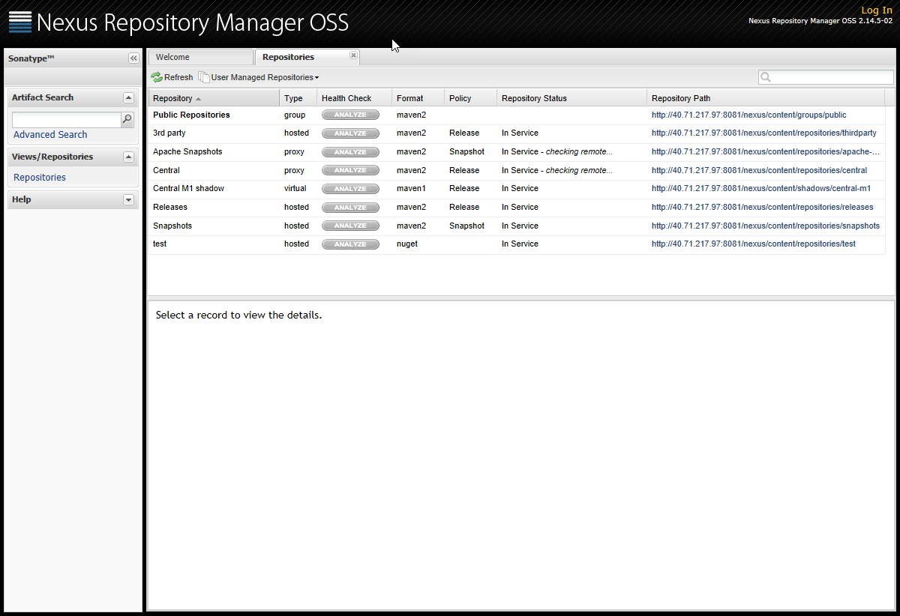
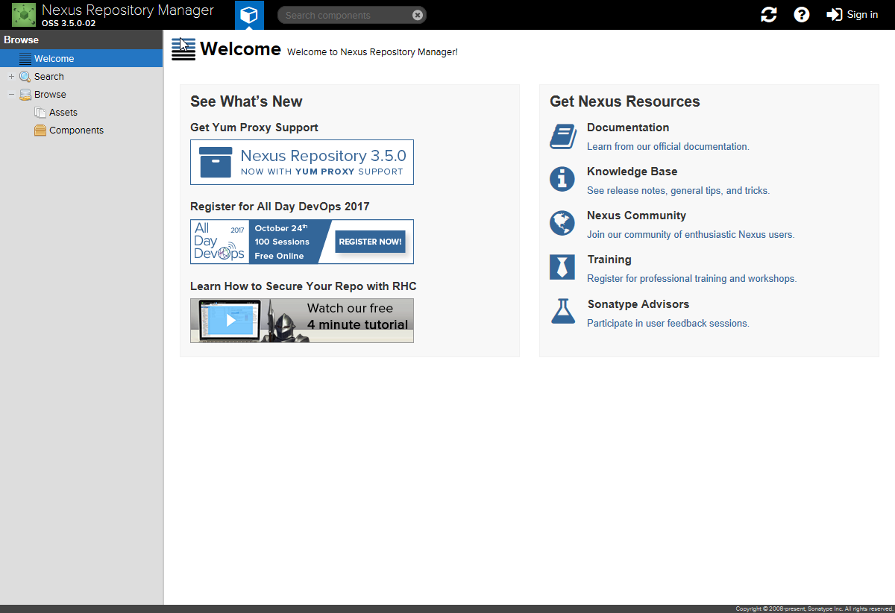
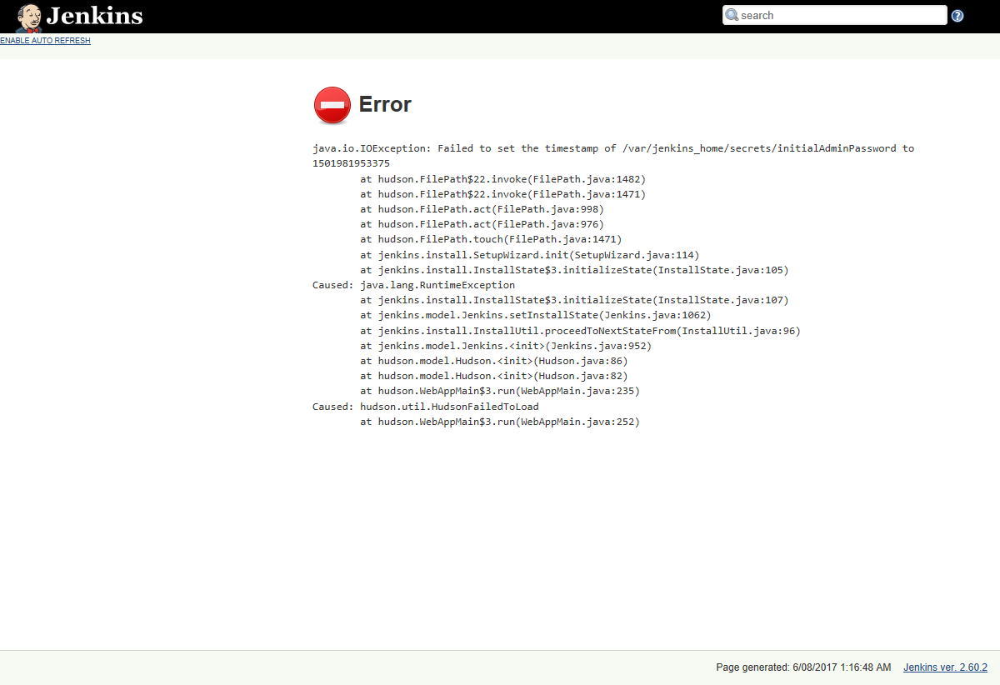

On the [back of yesterdays post](https://dscottraynsford.wordpress.com/2017/08/05/persistent-storage-in-azure-container-instances/) on running Azure Container Instance containers with persistent storage, I thought I'd try a couple of other containers with [my script](https://dscottraynsford.wordpress.com/2017/08/05/persistent-storage-in-azure-container-instances/).

_**Note:** I don't actually plan on running any of these apps, I just wanted to test out the process and my scripts to identify any problems._

I tried:

- [Sonatype Nexus 2](https://hub.docker.com/r/sonatype/nexus/) - sonatype/nexus:oss
- [Sonatype Nexus 3](https://hub.docker.com/r/sonatype/nexus3/) - sonatype/nexus3:latest
- [Jenkins](https://hub.docker.com/r/jenkins/jenkins/) - jenkins/jenkins

And here are the results of my tests:

## Sonatype Nexus 2

Works perfectly and the container starts up quickly (under 10 seconds):

I passed the following parameters to the script:

\[gist\]18b8545abe2a1bf555a33dd01fbb1454\[/gist\]

_**Note: The Nexus 2 server is only accessible on the path /nexus/.**_

## Sonatype Nexus 3

Works perfectly but after takes at least a minute to be accessible after the container starts. But this is normal behavior for Nexus 3.

I passed the following parameters to the script:

\[gist\]70f06115c4a764f23711fe483d85d9dc\[/gist\]

## Jenkins

Unfortunately Jenkins does not work with a persistent storage volume from an Azure Share. It seems to be trying to set the timestamp of the file that will contain the InitialAdminPassword, which is failing:

I passed the following parameters to the script:

\[gist\]a8bfee04c9b2f5dd607bf400990bf6a2\[/gist\]

So, this is still a little bit hit and miss, but in general Azure Container Instances look like a very promising way to run different types of services in containers without a lot of overhead. With a bit of automation, this could turn out to be a cost effective way to quickly and easily run some common services.
