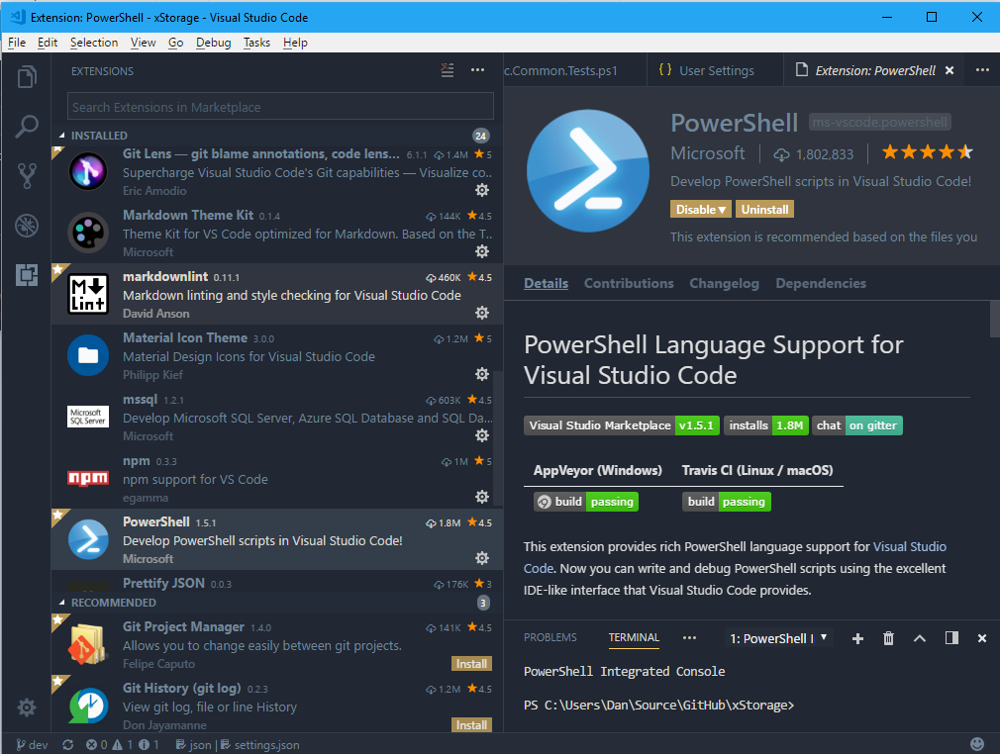

One of the features I'm most fond of in Visual Studio Code is the **Format Document** feature that is built into [Visual Studio Code](https://code.visualstudio.com/).

> Side Note: If you're writing PowerShell scripts or modules then you should be using **Visual Studio Code**. You should only be using **PowerShell ISE** if you don't have the ability to install **Visual Studio Code**.

The **Format Document** feature can be used in many different document types in Visual Studio Code to correct the layout based on your **user settings** or the **workspace settings** for the project you're working on.

This enables me to configure **Visual Studio Code** to auto format **PowerShell** code the way I like it for my own projects, but still adhere to the code formatting standards of any other projects I work on without having to remember what they are for each. This saves so much time and hassle.

> **Tip:** If you're contributing code to an Open Source project, the project maintainers may have included a **.vscode\\settings.json** in the project folder. This may contain **workspace** specific formatting settings that you should apply before submitting code back to the project.

But even if you've don't define and code formatting settings **Visual Studio Code** will still do a great job of formatting your PowerShell code. Having nicely formatted code really is not a requirement to being awesome at writing PowerShell, but it does make it easier for not so awesome PowerShell people to read, understand and potentially maintain your work.

# Formatting a PowerShell Script

Here are the simple instructions for auto formatting a document in Visual Studio Code:

1. [Download](https://code.visualstudio.com/download) and install Visual Studio Code.
2. Once Visual Studio Code is installed, add the **PowerShell** extension: 
3. In **Visual Studio Code**, open the **folder** of the **project** containing the file you want to format or open an individual PowerShell file (PS1, PSD1, PSM1). 
    
    > **Note: Workspace** formatting settings are only used if you've opened the **folder** rather than an individual file.
    
4. Press **SHIFT+****ALT+F** (or press **F1** and type **Format** and select **Format Document**). 
5. The code is now all well formatted, so save the document.

It really is as easy as that.

Happy formatting.
