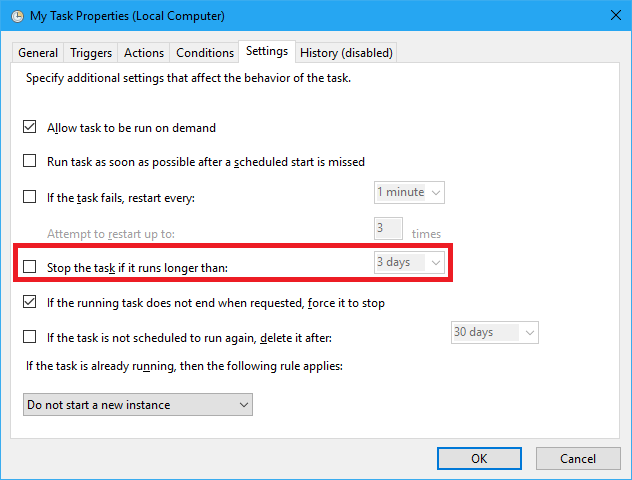

When creating a scheduled task in PowerShell you may wish to set the **Execution Time Limit** of the task to be **unlimited** (no time limit).

This will prevent the task from being terminated if it is still running after a specific period of time.

Creating scheduled tasks using PowerShell is pretty easy using the **\*-ScheduledTask\*** cmdlets in Windows Server 2012 and above.

However, after working on [this issue](https://github.com/PowerShell/xComputerManagement/issues/115) in the xScheduledTask DSC resource in the [Microsoft DSC Resource Kit](https://blogs.msdn.microsoft.com/powershell/tag/dsc-resource-kit/) I found that there are some differences in how to do this between Windows Server 2012 R2 and Windows Server 2016.

So in this post I'm going to show how to create a scheduled task with no Execution Time Limit that will work on both Windows Server 2012 R2 (and Windows 8/8.1) and Windows Server 2016 (and Windows 10).

I'll also show the method that works only on Windows Server 2016.

# All Versions of Windows Server

To create a scheduled task with unlimited **Execution Time Limit** on Windows Server 2012 R2 and Windows Server 2016.

\[gist\]c04396780617eb85b41652e5ec8a11dc\[/gist\]

This should also work on Windows Server 2012, but I have not confirmed this. It will NOT work on Windows Server 2008 R2. It should also work on Windows 8/8.1/10.

# Windows Server 2016 Only

To create a scheduled task with unlimited **Execution Time Limit** on Windows Server 2016 only:

\[gist\]15120718e869c0f5f281e43f378bc5b0\[/gist\]

This method is a more elegant approach and arguably how the Scheduled Task cmdlets are intended to be used. But you would only use this method if your task does not need to created on an operating system earlier than Windows Server 2016/Windows 10.

So, hopefully this will help anyone else out there who has struggled with this.
