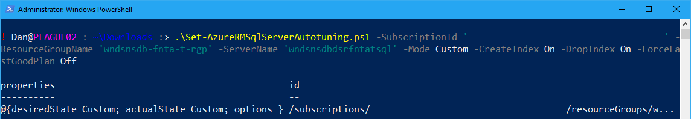
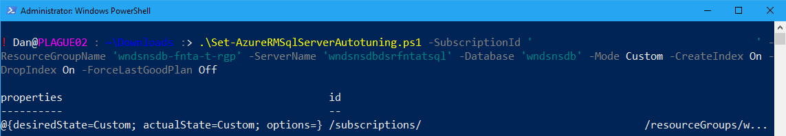

One thing I've found with configuring Azure services using automation (e.g. [Azure PowerShell Modules](https://docs.microsoft.com/en-us/powershell/azure/overview), [Azure Resource Manager template](https://docs.microsoft.com/en-us/azure/azure-resource-manager/resource-group-authoring-templates)) is that the automation features are a little bit behind the feature set. For example, the Azure PowerShell modules may not yet implement settings for new or preview features. This can be a an issue if you're strictly deploying everything via code (e.g. infrastructure as code). But if you run into a problem like this, all is not lost. So read on for an example of how to solve this issue.

# Azure REST APIs

One of the great things about Azure is that everything is configurable by making direct requests to the [Azure REST APIs](https://docs.microsoft.com/en-us/rest/api/), even if it is not available in ARM templates or Azure PowerShell.

Depending on the feature/configuration you can sometimes use the **Set-AzureRmResource** cmdlets to make calls to the REST APIs. But this cmdlet is limited to using an HTTP method of POST. So if you need to use PATCH, you'll need to find an alternate way to make the call.

So, what you need then is to use the **Invoke-RestMethod** cmdlet to create a custom call to the REST API. This is the process I needed to use to configure the [Azure SQL Server Automatic Tuning settings](https://docs.microsoft.com/en-us/azure/sql-database/sql-database-automatic-tuning-enable) and what I'll show in my script below.

# The Script

The following script can be executed in PowerShell (of course) and requires a number of parameters to be passed to it:

- **SubscriptionId** - the subscription Id of the Azure subscription that contains the Azure SQL Server.
- **ResourceGroupName** - The name of the resource group containing SQL Server or database.
- **ServerName** - The name of the Azure SQL Server to set the automatic tuning options on.
- **DatabaseName** **-** The name of the Azure SQL Database to set the automatic tuning options on. If you pass this parameter then the automatic tuning settings are applied to the Azure SQL Database, not the server.
- **Mode** - This defines where the settings for the automatic tuning are obtained from. Inherit is only valid if the **DatabaseName** is specified.
- **CreateIndex** **-** Enable automatic tuning for creating an index.
- **DropIndex** **-** Enable automatic tuning for dropping an index.
- **ForceLastGoodPlan -** Enable automatic tuning for forcing last good plan.

_**Requirements:** You need to have the [installed](https://docs.microsoft.com/en-us/powershell/azure/install-azurerm-ps) the **AzureRM.Profile PowerShell** module (part of the AzureRM PowerShell Modules) to use this script. The script also requires you to have logged into your Azure Subscription using **Add-AzureRmAccount** (as a user or [Service Principal](https://docs.microsoft.com/en-us/powershell/azure/create-azure-service-principal-azureps))._

\[gist\]f6538d555788ef35c14cbe14ff4790b1\[/gist\]

# Example Usage

To apply custom automatic tuning to an Azure SQL Server:

.\\Set-AzureRMSqlServerAutotuning.ps1 -SubscriptionId '<Subscription Id>' -ResourceGroupName '<Resource Group name>' -ServerName '<Azure SQL server name>' -Mode Custom -CreateIndex On -DropIndex On -ForceLastGoodPlan Off

To apply custom automatic tuning to an Azure SQL Database:

.\\Set-AzureRMSqlServerAutotuning.ps1 -SubscriptionId '<Subscription Id>' -ResourceGroupName '<Resource Group name>' -ServerName '<Azure SQL server name>' -DatabaseName '<Azure SQL database name>' -Mode Custom -CreateIndex On -DropIndex On -ForceLastGoodPlan Off

# Conclusion

I've not yet encountered something in Azure that I can't configure via the Azure REST APIs. This is because the Azure Management Portal uses the same APIs - so if it is available in the portal then you can do it via the Azure REST APIs. The biggest challenge is determining the body, header and methods available if the APIs are not yet documented.

If the API you need is not documented then you can raise a question in the [Microsoft Azure Forums](https://azure.microsoft.com/en-in/support/forums/) or on [Stack Overflow](https://stackoverflow.com/). Failing that you can use the developer tools in your browser of choice to watch the API calls being made to the portal - I've had to resort to this many times, but documenting that process is something I'll save for another day.
