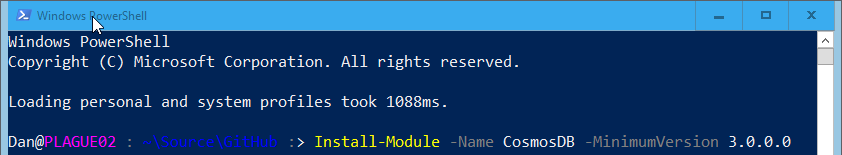
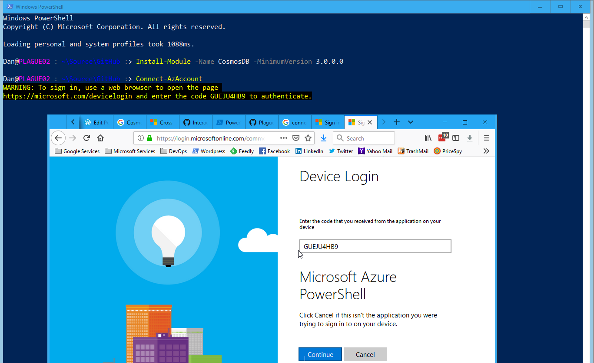
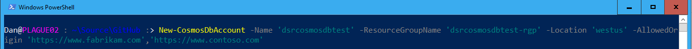
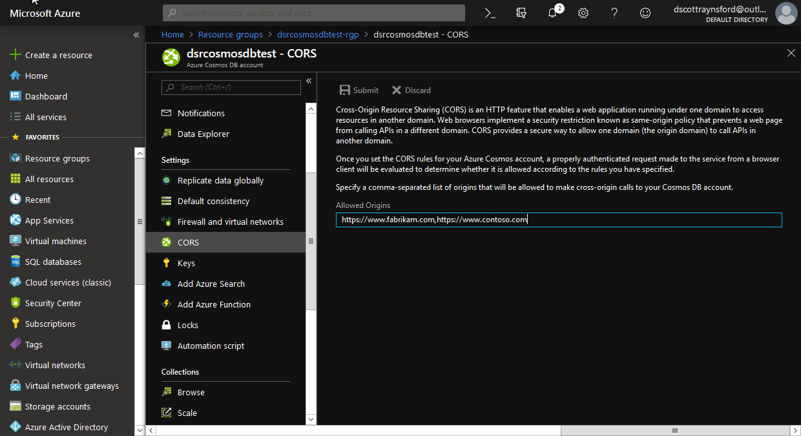
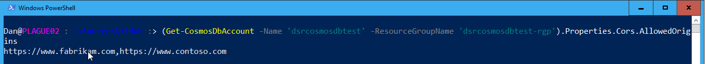
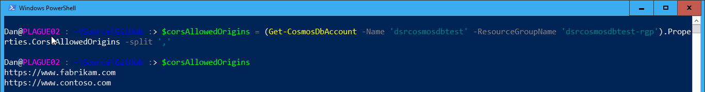
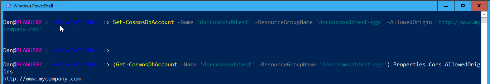
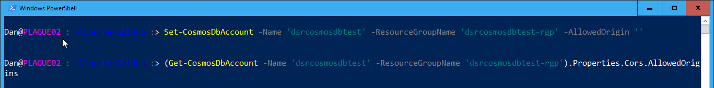

Support for **Cross-Origin Resource Sharing (CORS)** was [recently added](https://azure.microsoft.com/en-us/blog/azure-cosmos-now-supports-cross-origin-resource-sharing-cors/) to Cosmos DB. If you want to enable CORS on an existing Cosmos DB account or create a new Cosmos DB account with CORS enabled it is very easy to do with [Azure Resource Manager](https://docs.microsoft.com/en-us/azure/cosmos-db/how-to-configure-cross-origin-resource-sharing#enable-cors-support-from-resource-manager-template) (ARM) templates or the [Azure Portal](https://docs.microsoft.com/en-us/azure/cosmos-db/how-to-configure-cross-origin-resource-sharing#enable-cors-support-from-azure-portal).

But what if you're wanting to find out the state of the CORS setting on an account or set it using PowerShell? Well, look no further.

The [Cosmos DB PowerShell module](https://www.powershellgallery.com/packages/CosmosDB) (version 3.0.0 and above) supports creating Cosmos DB accounts with CORS enabled as well as updating and removing the CORS headers setting on an existing account. You can also retrieve the CORS setting for an existing Cosmos DB account.

## Installing the CosmosDB Module

The first thing you need to do is install the [CosmosDB PowerShell](https://www.powershellgallery.com/packages/CosmosDB) module from the PowerShell Gallery by running this in a PowerShell console:

\[gist\]3eeed8b49d04218487e828426cd38413\[/gist\]

This will also install the **Az PowerShell modules** [Az.Accounts](https://docs.microsoft.com/en-us/powershell/module/az.accounts/?view=azps-1.0.0#profile) and [Az.Resources](https://docs.microsoft.com/en-us/powershell/module/az.resources/?view=azps-1.0.0#resources) modules if they are not installed on your machine. The _\*-CosmosDbAccount_ functions in the CosmosDB module are dependent on these modules.

> _**Note:** The CosmosDB PowerShell module and the Az PowerShell modules are completely **cross-platform** and support **Linux**, **MacOS** and **Windows**. Running in either **Windows PowerShell** (Windows) or **PowerShell Core** (cross-platform) is supported._
> 
> _Versions of the CosmosDB PowerShell module earlier than 3.0.0.0 use the older AzureRm/AzureRm.NetCore modules and do not support the CORS setting._

## Authenticating to Azure with 'Az'

Before using the CosmosDB PowerShell module **accounts** functions to work with CORS settings you'll first need to **authenticate to Azure** using the **Az** **PowerShell Modules**. If you're planning on automating this process you'll want to [authenticate to Azure using a Service Principal identity](https://docs.microsoft.com/en-us/powershell/azure/authenticate-azureps?view=azps-1.0.0#sign-in-with-a-service-principal).

> **Side note**: if you're using this module in an Azure DevOps build/release pipeline the Azure PowerShell task will take care of the Service Principal authentication process for you:
> 
> 

But if you're just doing a little bit of experimentation then you can just use an [interactive authentication process](https://docs.microsoft.com/en-us/powershell/azure/authenticate-azureps?view=azps-1.0.0#sign-in-interactively).

To use the interactive authentication process just enter into your PowerShell console:

\[gist\]1e6a4c0e9361fe359ed06cd087f69408\[/gist\]

then follow the instructions.

## Create a Cosmos DB Account with CORS enabled

Once you have authenticated to Azure, you can use the **New-CosmosDbAccount** function to create a new account:

\[gist\]a9d50502fbf22aac340590d64dfa8844\[/gist\]

This will create a new Cosmos DB account with the name **dsrcosmosdbtest** in the resource group **dsrcosmosdbtest-rgp** in the **West US** location and with CORS allowed origins of **https://www.fabrikam.com** and **https://www.contoso.com**.

> **Important:** the **New-CosmosDbAccount** command assumes the resource group that is specified in the **ResourceGroup** parameter already exists and you have **contributor** access to it. If the resource group doesn't exist then you can create it using the **New-AzResourceGroup** function or some other method.

It will take Azure a few minutes to create the new Cosmos DB account for you.

> **Side note:** But if you want your PowerShell automation or script to be able to get on and do other tasks in the meantime, then add the **\-AsJob** parameter to the **New-CosmosDbAccount**call. This will cause the function to immediately return and provide you a **Job** object that you can use to periodically query the state of the Job. More information on using PowerShell Jobs can be found [here](https://blogs.technet.microsoft.com/heyscriptingguy/2012/12/31/using-windows-powershell-jobs/).
> 
> Be aware, you won't be able to use the Cosmos DB account until the Job is completed.

If you look in the Azure Portal, you will find the new Cosmos DB account with the CORS allowed origin values set as per your command:

## Get the CORS Allowed Origins on a Cosmos DB Account

Getting the current CORS Allowed Origins value on an account is easy too. Just run the following PowerShell command:

\[gist\]ff77e3dd09df9522e8707b13a147a4c0\[/gist\]

This will return a string containing all the CORS Allowed Origins for the Cosmos DB account **dsrcosmosdbtest**.

You could easily split this string into an array variable by using:

\[gist\]66896d43438aabee136c81c3c65dc2d3\[/gist\]

## Update the CORS Allowed Origins on an existing Cosmos DB Account

To set the CORS Allowed Origins on an existing account use the **Set-CosmosDbAccount** function:

\[gist\]1e4c55cf9f53f8e92de4b00c3d006bec\[/gist\]

This will take a few minutes to update. So you can use the **\-AsJob** parameter to run this as a Job.

## Remove the CORS Allowed Origins from an existing Cosmos DB Account

You can remove the CORS Allowed Origins setting by setting using the **Set-CosmosDbAccount** function but passing in an empty string to the **AllowedOrigin** parameter:

\[gist\]7c1f73da2955f87fe35e5aea93ec182b\[/gist\]

This will take a few minutes to update as well. As always, you can use the **\-AsJob** parameter to run this as a Job.

 

## Final Words

Hopefully, you can see it is fairly simple to **automate** and work with the **Cosmos DB CORS Allowed Origins** setting using the **PowerShell Cosmos DB module**.

If you have any [issues](https://github.com/PlagueHO/CosmosDB/issues) or queries or would like to contribute to the PowerShell Cosmos DB module, please head over to the [GitHub repository](https://github.com/PlagueHO/CosmosDB).
